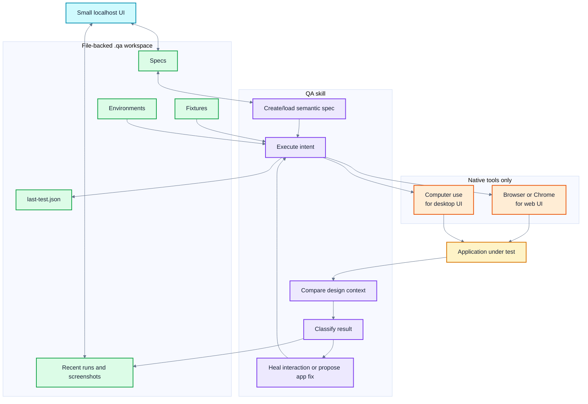
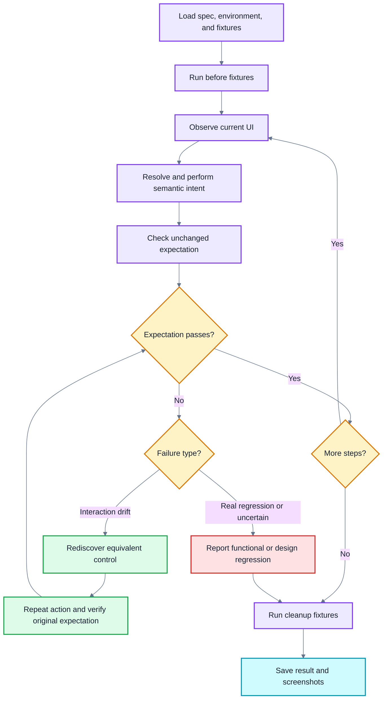

# Autonomous QA Agent with Design Intelligence & Self-Healing Test Automation

> Hackathon MVP specification for a Codex/Claude Code skill that creates, runs, heals, and reports semantic UI tests using native browser/Chrome/computer-use capabilities.

## The pitch

Traditional UI tests break when selectors or layouts change. This agent stores **what the user intends to do** and **what outcome must remain true**, then rediscovers the current UI on every run.

It also understands an optional design reference, so it can distinguish:

- A button moved or was renamed → recover the interaction and continue.
- The user-visible outcome broke → report a functional regression.
- The implementation no longer matches the approved design → report a design regression.

The hackathon product is a **skill plus a small file-backed QA workspace**. It uses native Browser/Chrome for web apps and computer use for desktop/native UI. Playwright and Stagehand are not required, including for fixtures.

## Phase 1–3 quick start

Phases 1 through 3 are implemented as a Node.js execution runtime, a repository-scoped skill, JSON Schema contracts, and the inspectable `.qa/` workspace. The runtime resolves environments and fixture inputs, starts the local demo when needed, executes through a supplied native Browser/Chrome or computer-use capability, records progress events and screenshots, always attempts cleanup, and persists the result. Phase 3 adds conservative semantic target rediscovery, observable-readiness recovery, unchanged-expectation guards, and evidence-backed `healed` classification.

```bash
npm install
npm run qa-agent -- init
npm run qa-agent -- create "a logged-in customer completes checkout" \
  --env local \
  --expect "Order confirmation is visible"
npm run qa-agent -- validate
```

The initializer is idempotent: it creates missing sample files and validates existing ones without overwriting edits. Common workspace operations are:

```bash
npm run qa-agent -- spec list
npm run qa-agent -- spec show checkout-card
npm run qa-agent -- fixture list
npm run qa-agent -- select checkout-card --env local
npm run qa-agent -- last
```

Use `spec save`, `fixture save`, `environment save`, or `result save` with a YAML/JSON filename (or `-` for standard input). Writes are validated before an atomic replacement, and cross-file references are checked before a spec or result is accepted.

Start the deterministic checkout target with:

```bash
npm run demo
# http://localhost:3000
```

The demo has explicit Phase 3 variants:

```bash
npm run demo -- --variant drift
# "Proceed to checkout" moves into a menu and becomes "Continue to payment"

npm run demo -- --variant drift-broken
# The interaction drifts and the final confirmation outcome is also broken
```

The unchanged checkout spec produces `healed` for `drift`, including before/after screenshots and a replacement-target explanation. It produces `functional_regression` for `drift-broken`, even though the earlier checkout action was recovered, because the original confirmation expectation still fails.

Then ask the autonomous-QA skill to `run checkout-card --env local` using native Browser/Chrome, or `run-last` to repeat the selected spec and environment. Set `QA_CUSTOMER_USERNAME` and `QA_CUSTOMER_PASSWORD` in the skill's environment; their resolved values are passed to the login fixture but are never stored. A bare `qa-agent run` process without a host-native executor deliberately produces `blocked` rather than claiming browser execution.

The runtime API exports `createNativeWebExecutor`, `createNativeDesktopExecutor`, `executeRun`, `classifyFailure`, and the expectation/rediscovery guards for host integrations. Native drivers can opt into `rediscover`, `recover`, and `waitFor`; recovery is never inferred from a merely similar target. Run the suite with `npm test`, or enforce 100% production line coverage and the configured branch/function gates with `npm run test:coverage`.

## What the demo must prove

1. Create an editable semantic test from a natural-language requirement.
2. Run it against a local app or an optional staging URL.
3. Reuse a fixture such as login, setup, or cleanup.
4. Compare the rendered product with an optional screenshot or Figma/design reference.
5. Survive a harmless UI change without changing the expected outcome.
6. Refuse to “heal” a real functional or design regression.
7. Save screenshots and a concise result that can be viewed in a small localhost UI.
8. Rerun the most recent test with one command.

## Hackathon scope

| Feature | Why it is core | Demo outcome |
| --- | --- | --- |
| Semantic test generation | Turns requirements into reusable QA assets | A prompt creates a YAML spec |
| Native execution | Avoids building another browser engine | Codex/Claude operates the live app |
| Reusable fixtures | Removes repeated login/setup/cleanup work | The same login fixture is used by multiple tests |
| Self-healing interactions | Main product differentiator | A renamed/moved control does not break the test |
| Immutable expectations | Prevents false-positive “healing” | A broken outcome remains a failure |
| Design intelligence | Main product differentiator | A visible design deviation is explained with evidence |
| Evidence-backed results | Makes autonomous output trustworthy | Run result includes screenshots and observations |
| Minimal UI | Makes the hackathon easy to understand | Specs and recent runs are visible and editable |
| Last-test pointer | Makes iteration fast | The latest scenario can be rerun immediately |

## Demo flow

```mermaid
%%{init: {"theme":"base","themeVariables":{"fontFamily":"Inter, ui-sans-serif, system-ui","lineColor":"#64748B","primaryTextColor":"#172033"}}}%%
flowchart LR
    REQ["Requirement"]
    SPEC["Semantic YAML spec"]
    FIX["Reusable fixtures"]
    DESIGN["Optional design reference"]
    AGENT["Codex or Claude QA skill"]
    NATIVE["Native Browser, Chrome, or computer use"]
    APP["Local or staging app"]
    DECIDE{"What changed?"}
    HEAL["Recover interaction\nand verify same expectation"]
    FAIL["Report real functional\nor design regression"]
    RESULT["Screenshot + result + recent history"]
    UI["Minimal localhost UI"]

    REQ --> SPEC --> AGENT
    FIX --> AGENT
    DESIGN --> AGENT
    AGENT --> NATIVE --> APP --> DECIDE
    DECIDE -- Harmless UI drift --> HEAL --> RESULT
    DECIDE -- Real regression --> FAIL --> RESULT
    RESULT --> UI

    classDef input fill:#DBEAFE,stroke:#2563EB,color:#172033,stroke-width:2px;
    classDef agent fill:#EDE9FE,stroke:#7C3AED,color:#172033,stroke-width:2px;
    classDef execute fill:#FFEDD5,stroke:#EA580C,color:#172033,stroke-width:2px;
    classDef decision fill:#FEF3C7,stroke:#D97706,color:#172033,stroke-width:2px;
    classDef pass fill:#DCFCE7,stroke:#16A34A,color:#172033,stroke-width:2px;
    classDef fail fill:#FEE2E2,stroke:#DC2626,color:#172033,stroke-width:2px;
    classDef output fill:#CFFAFE,stroke:#0891B2,color:#172033,stroke-width:2px;

    class REQ,SPEC,FIX,DESIGN input;
    class AGENT agent;
    class NATIVE,APP execute;
    class DECIDE decision;
    class HEAL pass;
    class FAIL fail;
    class RESULT,UI output;
```



## Architecture



### Responsibilities

| Part | Responsibility |
| --- | --- |
| QA skill | Understand the request, create/load specs, use fixtures, drive native tools, classify failures, and write results |
| Native Browser/Chrome | Interact with web applications and collect available page, screenshot, console, and network evidence |
| Computer use | Interact with Electron, native applications, or dialogs outside the webpage |
| `.qa/` workspace | Store the editable current state and recent evidence |
| Localhost UI | Show/edit specs and inspect recent runs; it does not run a separate agent platform |

## Minimal repository structure

```text
.agents/
└── skills/
    └── autonomous-qa/
        ├── SKILL.md
        └── scripts/
            └── qa-agent

.qa/
├── environments.yaml
├── fixtures/
│   ├── login-customer.yaml
│   └── cleanup-test-order.yaml
├── specs/
│   └── checkout-card.yaml
├── last-test.json
└── runs/
    └── <run-id>/
        ├── result.json
        └── screenshots/
```

No database is required for the hackathon. The UI reads these files directly. Keep only the latest 20 runs per test or expose a “delete run” action.

## Environments

The target is optional. If no target is supplied, use the local application discovered in the repository or ask the user to start/select it.

```yaml
# .qa/environments.yaml
version: 1

environments:
  local:
    type: web
    baseUrl: http://localhost:3000
    startCommand: npm run dev

  staging:
    type: web
    baseUrl: ${QA_STAGING_URL}

  desktop:
    type: desktop
    app: ${QA_DESKTOP_APP}
```

For the hackathon, production execution is out of scope. This avoids spending demo time on destructive-action policy and production credentials.

## Fixtures

A fixture is **any reusable semantic workflow**. It is not Playwright code and it does not need Stagehand. The same native executor runs fixtures and test steps.

Useful fixture categories:

- Login or logout.
- Create or remove test data.
- Select a tenant/workspace.
- Navigate to a reusable starting state.
- Add an item to a cart.
- Dismiss onboarding or cookie dialogs.
- Reset state or clean up after a test.

Fixtures can run before, after, or between test steps. Cleanup fixtures should be idempotent: if the target is already clean, they pass.

```yaml
# .qa/fixtures/login-customer.yaml
version: 1
id: login-customer
title: Log in as a customer

inputs:
  username: ${QA_CUSTOMER_USERNAME}
  password: ${QA_CUSTOMER_PASSWORD}

steps:
  - intent: Open the login page
  - intent: Sign in with the supplied customer credentials

expect:
  - Customer dashboard is visible
```

```yaml
# .qa/fixtures/cleanup-test-order.yaml
version: 1
id: cleanup-test-order
title: Remove the order created by this test

steps:
  - intent: Open the order created during this run
  - intent: Delete it if it exists

expect:
  - The test order is absent

idempotent: true
```

Secrets are read from environment variables and must never be copied into specs, results, or screenshots.

## Semantic test specification

Store intent and observable outcomes—not CSS selectors, XPath, or screen coordinates.

```yaml
# .qa/specs/checkout-card.yaml
version: 1
id: checkout-card
title: Customer completes checkout

environment: staging

fixtures:
  before:
    - login-customer
    - cart-with-one-item
  after:
    - cleanup-test-order

design:
  reference: ${QA_CHECKOUT_DESIGN}
  viewport:
    width: 1440
    height: 1000

steps:
  - intent: Open the shopping cart
    expect:
      - Cart contains one item

  - intent: Proceed to checkout
    expect:
      - Checkout form is visible

  - intent: Submit the approved test payment details
    expect:
      - Order confirmation is visible
      - No error message is shown
```

The agent records the actual element it chose in the run result. It does not need to modify the spec merely because the DOM changed.

## Execution and self-healing



### Allowed healing

- Rediscover a moved or renamed control.
- Open a menu before choosing the same destination.
- Replace brittle timing with a wait for visible readiness.
- Use an equivalent accessible target for the same action.

### Never heal automatically

- Expected text or business outcomes.
- Success/error state expectations.
- Design baselines.
- Accessibility expectations explicitly present in the spec.
- A fixture's postcondition.

The proof of healing is simple: the agent must rerun the action and pass the **original expectation unchanged**.

## Design intelligence

For the hackathon, support one optional design reference per test:

- A screenshot file.
- A Figma frame/link when a connector is available.
- A reference image supplied in the prompt.

Compare only demoable signals:

1. Required components and content are present.
2. Major layout, order, grouping, alignment, and responsive behavior are plausible matches.
3. Obvious style differences in color, spacing, typography, or component variant are reported with screenshots.

The design reference must be explicit. The agent may suggest a design issue from its own judgment, but only a supplied reference can produce a `design_regression` result.

## Result classification

Keep the taxonomy small:

| Classification | Meaning |
| --- | --- |
| `passed` | Required expectations passed |
| `healed` | Interaction mechanics changed, but the original expectation passed after recovery |
| `functional_regression` | Required behavior or user-visible outcome failed |
| `design_regression` | The implementation conflicts with the supplied design reference |
| `blocked` | Login, fixture, environment, or native-tool capability prevented execution |

Each result should contain:

- Spec and environment.
- Pass/fail status per step.
- Selected UI target summary.
- Healing attempt, if any.
- Failure classification and concise explanation.
- Before/failure/after screenshots where relevant.
- Available console or network errors.

## Minimal UI

Run locally:

```bash
qa-agent ui
# http://localhost:4173
```

Build one page with three areas:

1. **Tests** — list specs, environment, last status, and a copyable run/rerun command.
2. **Editor** — edit and save the YAML spec or fixture.
3. **Recent runs** — view status, screenshots, healing explanation, and delete a run.

Do not build authentication, a database-backed revision system, analytics, organization management, or an embedded MCP UI for the hackathon.

## Operations

Logical operations:

```text
create "test checkout with a logged-in customer"
run checkout-card --env staging
run-last
edit checkout-card
create-fixture "customer login"
open-ui
```

Example invocation:

```text
Codex:   $autonomous-qa run checkout-card --env staging
ChatGPT: @autonomous-qa run checkout-card --env staging
Claude:  Use the autonomous QA skill to run checkout-card on staging.
```

`last-test.json` only needs:

```json
{
  "specId": "checkout-card",
  "environment": "staging",
  "lastRunId": "run_20260827_143501"
}
```

## Recommended hackathon demo

Use a small checkout or registration app with a supplied design screenshot.

### Demo 1 — Create and pass

1. Ask the skill to create the test from a short requirement.
2. Reuse the login fixture.
3. Run the test and show the passing steps and screenshot in the UI.

### Demo 2 — Self-heal harmless drift

1. Rename “Proceed to checkout” to “Continue to payment” and move it into a menu.
2. Rerun the unchanged spec.
3. Show that the agent found the equivalent control and verified the same checkout-page expectation.

### Demo 3 — Refuse to hide a real bug

1. Break the confirmation state or payment response.
2. Rerun the same spec.
3. Show that the agent reports `functional_regression` and does not rewrite the expectation.

### Demo 4 — Design intelligence

1. Change an obvious component order, spacing, color, or variant from the supplied reference.
2. Run the design-aware test.
3. Show the reference, actual screenshot, and concise `design_regression` explanation.

If time permits, let the coding agent patch the demonstrated application bug and rerun the same test to show a verified fix. This is a bonus, not a dependency for the core demo.

## Acceptance checklist

The hackathon MVP is complete when:

- [ ] A natural-language requirement creates an editable semantic YAML test.
- [ ] Local or staging web execution works through native Browser/Chrome.
- [ ] A desktop target can use computer use when available.
- [ ] Login and cleanup fixtures can be reused.
- [ ] A moved or renamed control produces `healed`, not a false failure.
- [ ] A broken expected outcome produces `functional_regression`, not an edited assertion.
- [ ] A supplied design reference can produce an evidence-backed `design_regression`.
- [ ] Screenshots and structured results are stored under `.qa/runs/`.
- [ ] `run-last` reruns the most recent spec.
- [ ] The localhost UI can edit a spec and display/delete recent runs.

## Explicitly out of scope

- Playwright, Stagehand, or another browser-automation engine.
- Headless CI, scheduling, parallel execution, and browser matrices.
- Production testing and destructive production policies.
- SQLite, complex migrations, unlimited revision history, and elaborate retention workers.
- Video recording, trace viewers, or long-term artifact storage.
- Multi-user authentication, roles, organizations, cloud hosting, or billing.
- A full visual-diff engine or automated Figma component library reconciliation.
- Automatic design-baseline or expected-outcome updates.
- Enterprise audit/compliance features.

## Build order

See [phases.md](phases.md) for the phased implementation plan and per-phase exit criteria.

1. Semantic spec, fixture, and result schemas.
2. Skill workflow plus native Browser/Chrome execution.
3. Self-healing classifier with unchanged-expectation verification.
4. Screenshot/reference-based design check.
5. File-backed run history and `last-test.json`.
6. Minimal localhost UI.
7. Polish the four demo scenarios and failure explanations.

## References

- [OpenAI: Browser](https://learn.chatgpt.com/docs/browser)
- [OpenAI: Computer use](https://learn.chatgpt.com/docs/computer-use)
- [OpenAI: Build skills](https://learn.chatgpt.com/docs/build-skills)
- [Claude Code: Use Claude Code with Chrome](https://code.claude.com/docs/en/chrome)

---

The hackathon story should stay crisp: **the agent understands intent and design, survives harmless UI drift, and refuses to normalize real bugs.**
