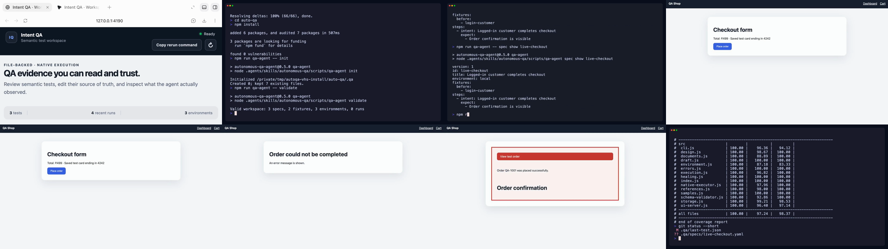
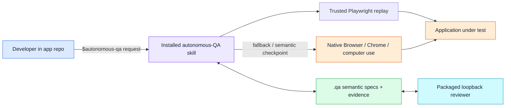

# Autonomous QA

Autonomous QA is an installable agent that takes a web application URL as its
sole required input and owns the complete test lifecycle: discovery, Planner,
coverage review, Generator, execution, failure-only Healer/triage, and final
quality reporting. The developer installs one skill, stays in the application
repository, and receives selector-free semantic tests plus inspectable evidence
without a manual handoff between stages.

The optional loopback **Console** exposes every orchestration option and renders
the same file-backed decisions. It composes `$autonomous-qa` requests; it is not
a separate runner. See [Challenge alignment](docs/challenge-alignment.md) for the
official requirements, judging weights, scope boundary, and submission index.

## Autonomous orchestration engine

The developer-facing route is the installed skill described below. Maintainers
can inspect the same orchestration engine directly with a URL as the only
required argument; credentials, intent, and PRD are optional:

```bash
node .agents/skills/autonomous-qa/scripts/qa-agent.mjs orchestrate \
  --url http://127.0.0.1:4555 \
  --username demo --password demo \
  --prompt "focus on checkout and authentication" \
  --prd docs/prd.md
```

The command above shows optional inputs for a richer demonstration. The minimal
valid invocation is `qa-agent orchestrate --url <web-application-url>`.

The pipeline runs with zero human input between stages: probe → fetch-only
crawl + test-plan synthesis (optionally handed to a Planner sub-agent
capability, which falls back to the deterministic planner on a rejected or
missing draft) → coverage gate (pass / replan / escalate, scored on whether
the suite can pass, not the plan's shape) → Playwright spec generation with
fetch preflight → browser replay → semantic execution → locator-chain
healing with bug-vs-broken triage → `report.json`/`report.md` with PRD-gap
analysis, all schema-validated (`schemas/`) before being written. Every
decision lands in `trace.jsonl`, viewable via
`GET /api/orchestrations/:id/trace` on the loopback UI. See
[docs/architecture.md](docs/architecture.md) and
[docs/ORCHESTRATOR_DEMO.md](docs/ORCHESTRATOR_DEMO.md).

Two honest notes: (a) shell mode without a browser executor reports `blocked`
with the missing-capability reason rather than guessing — use
`scripts/run-with-playwright.mjs` (devDependency `@playwright/test`,
`npx playwright install chromium`) for real browser runs, or the installed
skill's own native Browser/Chrome/computer-use capability; (b) generated
Playwright files and locator sidecars are disposable mechanical artifacts.
Fetch preflight can reject obvious misses, but only browser replay proves runtime
behavior. Semantic YAML is canonical, and source hashes reject edited artifacts.

## The one-skill developer experience

The developer experience below is deliberately small: **install one skill, open the application repository, and describe what to test**. The skill owns setup, runtime commands, application reachability, native UI execution, evidence persistence, reruns, and the optional local results UI. It is also what the orchestration agent above reuses for spec execution — see [docs/architecture.md](docs/architecture.md).

### Install once

In Codex, install the skill directly from this repository:

```text
$skill-installer Install https://github.com/sudip-mondal-2002/auto-qa/tree/main/.agents/skills/autonomous-qa
```

The skill is available on the next turn. It contains its own bundled runtime, dependencies, schemas, and UI assets. Your application does **not** add an `autonomous-qa` dependency, npm script, service, or database.

### Use it from the application project

Open the app repository in Codex and ask for the outcome you want:

```text
$autonomous-qa Set up QA for this app and verify that a logged-in customer can complete checkout. Keep the order confirmation visible as the required outcome, save screenshots, and show me the evidence.
```

That single request makes the skill:

1. inspect the app's existing development command and local URL;
2. create a project-specific `.qa/` workspace without demo/sample tests;
3. write and validate semantic specs and reusable fixtures;
4. start or reuse the app safely on loopback;
5. reuse a validated adjacent Playwright replay when possible, otherwise drive the journey through native Browser/Chrome or computer use;
6. preserve the original expectations during any healing attempt;
7. save the result and screenshots under `.qa/runs/`;
8. open the packaged loopback results UI when evidence should be reviewed.

For the next iteration, keep talking to the skill rather than operating a runner:

```text
$autonomous-qa Rerun the last test and keep every expectation unchanged.
```

```text
$autonomous-qa Run checkout-design and compare its declared checkpoint with the approved reference.
```

The developer stays in the application project. The internal `qa-agent` launcher is a skill implementation detail, not part of the day-to-day workflow.

### Recorded developer demo

[](artifacts/live-demo/auto-qa-live-demo.mp4)

[Watch or download the demo (4:02)](artifacts/live-demo/auto-qa-live-demo.mp4). It uses conversational neural narration and shows the supported install path, a clean standalone app project with no QA dependency, one natural-language QA request, native UI execution, evidence review, conservative healing, a real functional failure that stays failed, and explicit-reference design regression detection.

Use [demo.md](demo.md) for the current judge-facing flow. [LIVE_DEMO.md](LIVE_DEMO.md) preserves the older recording's timing only. The repository also includes [captions](artifacts/live-demo/auto-qa-live-demo.vtt), the [voiceover](artifacts/live-demo/auto-qa-live-demo-voiceover.mp3), a frame-accurate [timing manifest](artifacts/live-demo/timing.json), a [contact sheet](artifacts/live-demo/contact-sheet.png), and the reproducible [renderer](artifacts/live-demo/render-live-demo.mjs).

For an adversarial follow-up, run `npm run demo:corners`. It verifies all 28
planner, healing, design, and executor contracts in
[the corner-case matrix](docs/corner-test-cases.md), prints the live reset command
where one exists, and supports a focused drill such as
`npm run demo:corners -- --case H7`. Use `npm run demo:reset -- --list` to see
the deterministic app mutations without restarting the server.

### What is implemented

All five phases in [phases.md](phases.md) are complete.

| Phase | Current implementation |
| --- | --- |
| Foundation | JSON Schema contracts, path-based validation, guarded IDs and paths, atomic file-backed writes, environments, fixtures, specs, results, and last-test selection. |
| Native execution | Web and desktop executor contracts, project-local startup/reuse, semantic fixture and step execution, observations, screenshots, cleanup, and explicit blocked results when native capability is missing. |
| Conservative self-healing | One retry for an explicitly equivalent accessible target, unchanged-expectation verification, before/after evidence, and refusal to heal business outcomes. |
| Design intelligence | Explicit local/remote/Figma references, declared viewport/checkpoint, actual/reference provenance, structured layout/style findings, and a separate design classification. |
| UI and demo | Packaged loopback workspace, editable validated YAML, polling results, screenshot inspection, safe run deletion, prompt-based reruns, a standalone deterministic demo app, and synchronized demo media. |

The installed skill is now a portable package:

```text
.agents/skills/autonomous-qa/
├── SKILL.md
├── runtime/
│   ├── qa-agent.mjs         # bundled runtime, including Playwright
│   └── playwright-core/     # package/browser metadata only
├── schemas/
├── scripts/
│   ├── qa-agent
│   └── qa-agent.mjs
└── ui/
```

It does not import `src/` or `node_modules/` from this development repository. Automated coverage copies the skill to a separate directory, invokes it from an external CommonJS app project whose path contains spaces, performs setup and a native-executor run, saves evidence, serves the packaged UI, and confirms the app's `package.json` remains untouched.

### Correctness contract

Semantic specs store intent and observable outcomes—not CSS selectors, XPath, DOM paths, coordinates, fixed delays, or browser-specific scripts.

```yaml
version: 1
id: checkout-card
title: Customer completes checkout
environment: local

fixtures:
  before:
    - login-customer
  after:
    - cleanup-test-order

steps:
  - intent: Open the shopping cart
    expect:
      - Cart contains one item

  - intent: Proceed to checkout
    expect:
      - Checkout form is visible

  - intent: Submit the approved test payment details
    expect:
      - Order confirmation is visible
      - No error message is shown
```

The result taxonomy is intentionally strict:

| Classification | Meaning |
| --- | --- |
| `passed` | Every declared expectation passed without recovery. |
| `healed` | Interaction mechanics drifted, one equivalent retry worked, and the original expectations passed unchanged. |
| `functional_regression` | An action or required visible outcome failed. The expectation is not rewritten. |
| `design_regression` | Functionality passed, but an explicit reference and actual screenshot support concrete design findings. |
| `blocked` | The environment, fixture, credential, native capability, or declared comparison could not proceed reliably. |

Healing may rediscover a moved or renamed control, open a newly introduced menu, or wait for observable readiness. It may not change expected copy, business outcomes, success/error states, accessibility requirements, fixture postconditions, or design baselines. Uncertainty never becomes a pass.

### File-backed evidence

The skill creates these files in the application repository:

```text
.qa/
├── environments.yaml
├── fixtures/
├── specs/
│   ├── <id>.yaml
│   ├── <id>.playwright.mjs
│   └── <id>.playwright.json
├── last-test.json
└── runs/
    └── <run-id>/
        ├── result.json
        └── screenshots/
```

These are ordinary reviewable project files. Credential inputs stay as environment references such as `${QA_CUSTOMER_PASSWORD}` and resolved values must never appear in YAML, terminal output, results, or screenshots. The most recent 20 results per spec are retained.

### What happens with the two UIs

There are two browser surfaces, but the developer does not operate two platforms:

- **The application UI** is the system under test. The skill starts or reuses its existing local development command. Trusted reruns use the bundled Playwright runtime and an installed Chrome-family browser; missing, stale, unavailable, or failed replays fall back to the native UI capability once.
- **The QA workspace UI** is a loopback-only view over `.qa/`. The skill starts it when evidence should be inspected. Its **Workspace** tab edits the same validated YAML and displays completed run evidence. Its integrated **Console** tab is the single URL-first prompt composer and orchestration dashboard: every supported flag, live pipeline stages, coverage scorecard, planner comparison, and orchestration explorer use the same repository-backed evidence. Console username/password values are visible and intended only for disposable demo accounts.

The workspace UI does not execute tests, schedule jobs, maintain a second copy of state, or expose a remote service. Console may include visible disposable demo credentials in its generated `$autonomous-qa` prompt; it must never be used for production or reusable secrets. Setup, reruns, native execution, and evidence remain owned by the installed skill rather than leaking internal shell commands. See [scripts.md](scripts.md) for exact lifecycle and persistence behavior.

### Standalone demo project

[`demo-app/`](demo-app/) is a standalone Node project with no dependency on the QA runtime. It provides deterministic pass, interaction-drift, functional-failure, and design-failure states.

When developing only the demo app:

```bash
cd demo-app
npm run dev
```

Its reset helper is an app-development utility, not part of the skill runtime:

```bash
npm run reset -- pass
npm run reset -- drift
npm run reset -- functional
npm run reset -- design
```

The helper accepts only loopback HTTP targets and changes only the demo process's in-memory state. The live demo asks the installed skill to manage QA from this project; it never asks the presenter to clone or operate the QA implementation repository.

### Architecture

The exact current topology, dispatch algorithm, context envelopes, artifact
layout, and concurrency rules are documented in
[Current orchestration structure](docs/current-orchestration-structure.md).
The audit, before/after decisions, and measured cold/repeat results are in
[Optimized agent orchestration](docs/optimized-agent-orchestration.md). See the
[documentation map](docs/README.md) for current versus historical material.



## QA benchmark — primary

[`benchmarks/qa/`](benchmarks/qa/) is the project's primary benchmark pack. It
uses the recent open-source [WebTestBench](https://github.com/friedrichor/WebTestBench)
for candidate-masked test generation and specification-based defect verdicts, plus
[ReproBreak](https://github.com/rub-sq/ReproBreak) for conservative test
self-healing. The fixed core track contains 14 generation tasks, 56 balanced
Pass/Fail regression checks across seven application categories and four QA
dimensions, and the eight locator breaks in ReproBreak's official reduced set.

```bash
npm run benchmark:qa:prepare
npm run benchmark:qa:heal -- --output <result-directory>
npm run benchmark:qa:score -- --run <run-id>
npm run benchmark:qa:verify -- --run <run-id>
```

Candidate and evaluator files are separated and integrity-checked. The
published composite is zero unless every generated test is judged, every
regression case is answered, healing preserves every expectation, all healing
evidence is present, and the false-heal rate is zero. This is a compact derived
track over public upstream labels—not an official WebTestBench/ReproBreak
leaderboard score or a secret holdout. See the [protocol and category
definitions](benchmarks/qa/README.md).

Recorded disclosed run: **78.1% safety-gated composite**—68.6% custom
checklist-overlap F1, 37/56 WebTestBench-derived defect verdicts correct (61.2%
Fail F1, 78.6% specificity), and 8/8 safe heals with all 8 matched behavior
regressions protected on the deterministic healing conformance core. All 263
generated checks were separately aligned and all 56 defect cases were answered.
See the [independently re-scoreable report](benchmarks/qa/results/codex-host-v1/report.md).

## Web-agent capability benchmark — secondary

The secondary maintainer suite includes a frozen, exact-scored 21-task track derived
from [WebForge-Bench](https://github.com/yuandaxia2001/WebForge). This is a
**web-agent task-completion benchmark, not a QA benchmark**: it measures whether an
agent can finish requested browser workflows, not whether Autonomous QA can generate
tests, heal broken tests, or identify regressions. It covers every
domain × difficulty stratum with non-stochastic operation-code tasks, filters
fixtures that reference external hosts, pins the upstream code and dataset
revisions, and verifies every downloaded Git/LFS asset by content digest.

```bash
npm run benchmark:webforge:prepare
npm run benchmark:webforge:serve -- --task <task-id> --port 0
npm run benchmark:webforge:record -- --run <run-id> --task <task-id> \
  --answer <operation-code> --actions <count> --elapsed <seconds> \
  --origin <WEBFORGE_ORIGIN> --evidence <run-evidence-path>
npm run benchmark:webforge:score -- --run <run-id>
```

See [benchmarks/web-agent/webforge/README.md](benchmarks/web-agent/webforge/README.md) for the blind
execution protocol, fixed denominator, evidence requirements, provenance, and
the boundary between this WebForge-derived track and the official 934-task
leaderboard.

Recorded demonstration result: **18/21 exact completions (85.7%) on the frozen
WebForge-derived operation-code-only track**, including 7/7 observed Level-2 cases
and 5/7 observed Level-3 cases. Final-state screenshot files cover all 21 attempts.
The published submission hashes and expected-hash commitment make the total
independently auditable. This disclosed track is now retired for future blind runs.
See the [published report](benchmarks/web-agent/webforge/results/native-chrome-v2/report.md).

## Submission readiness

| Problem-statement deliverable | Canonical repository artifact |
| --- | --- |
| Working live prototype | Installable skill in `.agents/skills/autonomous-qa/` with `ui/` Console and Workspace |
| Clear setup instructions | [The one-skill developer experience](#the-one-skill-developer-experience) |
| Architecture and pipeline design | [Architecture diagram](docs/architecture.md) and [current orchestration structure](docs/current-orchestration-structure.md) |
| Demo video, two to five minutes | [4:02 developer demo](artifacts/live-demo/auto-qa-live-demo.mp4) |
| Presentation deck | [Diagram-fixed HTML deck](docs/deck/draft_1_diagrams_fixed.html) |

The exact must-have, good-to-have, bonus, judging-weight, and event-day-target
mapping is in [Challenge alignment](docs/challenge-alignment.md).

## Repository development

The commands below are for maintainers of the skill package, not application developers:

```bash
npm install
npm run build:skill
npm test
npm run test:coverage
npm run test:soak
npm run benchmark:replay
npm run benchmark:orchestration -- --samples 30 --warmups 3
```

`build:skill` bundles `ajv`, `yaml`, and only Playwright's matcher/browser-control runtime—not the Playwright test runner or a browser binary—and copies authoritative schemas/UI assets into the installable skill. The runtime uses an already-installed Chrome or Edge channel and never invokes browser installation. Tests rebuild the artifact automatically. Coverage gates enforce 100% production line coverage, at least 95% branch coverage, and at least 98% function coverage.

For internal diagnostics, maintainers can invoke `.agents/skills/autonomous-qa/scripts/qa-agent`, including `replay status <spec-id>` and `replay validate <spec-id>`. A bare shell run can complete only through a trusted replay; if replay is unavailable and no host-native executor exists, it saves `blocked`.

## Scope boundaries

In line with the challenge brief, the MVP excludes production deployment or hosting at scale, CI/CD integration, cross-browser matrix testing, complete production-application coverage, and manually authored executable test scripts. It also intentionally excludes Stagehand, coordinate scripts, fixed sleeps, scheduling, databases, remote UI hosting, multi-user auth, automatic baseline updates, and pixel-perfect visual diffing. The installed skill bundles its own Playwright runtime but never changes the tested application's dependencies or downloads browsers; it launches an existing Chrome or Edge channel headlessly. Generated replays are constrained, import-free artifacts and are trusted only after three zero-retry fresh-context validations.

The product promise stays narrow: **install one skill, describe intent in the application project, survive harmless UI drift, and keep real functional or design regressions visible.**

## References

- [OpenAI Codex skills](https://developers.openai.com/codex/skills)
- [OpenAI Codex](https://developers.openai.com/codex/)
