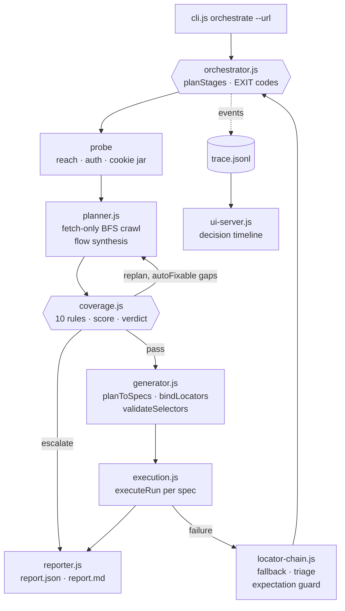

# Orchestrator architecture (as implemented)

Two honest notes: shell mode without an executor reports `blocked` with the missing-capability reason rather than guessing, and generated Playwright files are portable artifacts validated against the live DOM — execution runs on the semantic engine.
