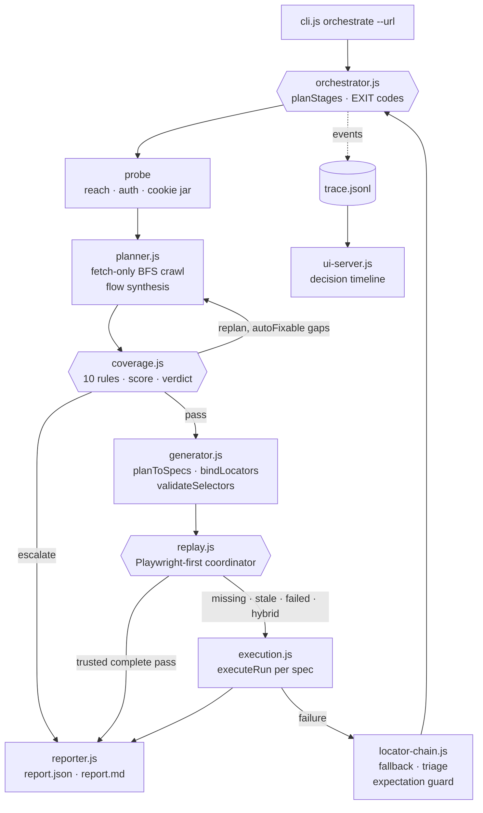

# Orchestrator architecture (as implemented)

Semantic YAML remains the source of truth. Each web spec may have an adjacent import-free Playwright script and replay manifest. A script becomes trusted only after three consecutive zero-retry runs in fresh contexts. Trusted complete passes bypass the agent; missing, stale, unavailable, failed, or safely non-deterministic replay portions fall back through the semantic executor once.
