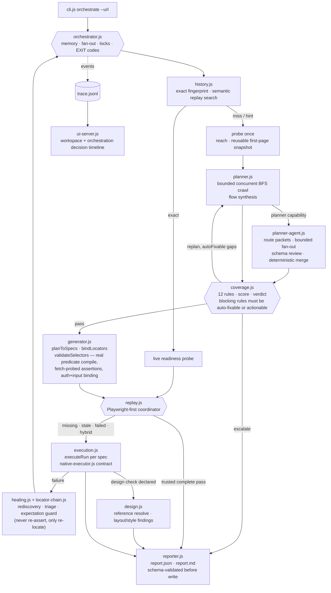

# Orchestrator architecture (as implemented)

This is the compact diagram. For the exact dispatch pseudocode, concurrency
scheduler, capability envelopes, memory keys, and `.qa/` tree, see
[Current orchestration structure](current-orchestration-structure.md).

In the challenge's terminology, the three required specialised roles map to
Planner (`planner-agent.js`), Generator (`generator.js`), and failure-only
Healer (`healing.js` plus the executor's constrained rediscovery capability).
They are capability seats coordinated by the meta-agent, not three persistent
services. The coverage gate sits between Planner and Generator and the final
Reporter synthesises their validated outputs.

Semantic YAML remains the source of truth. Each web spec may have an adjacent
import-free Playwright script and replay manifest. A script becomes trusted
only after three consecutive zero-retry runs in fresh contexts. Trusted
complete passes bypass the agent; missing, stale, unavailable, failed, or
safely non-deterministic replay portions fall back through the semantic
executor once.

Two pipelines share this codebase:

- **`orchestrate`** (above): URL in, test suite out. Zero human input between
  stages. This is the hackathon-track entry point.
- **The one-skill developer experience** (`setup`/`create`/`spec save`/`run`):
  a developer describes a journey, the skill writes semantic YAML directly
  (no crawl/plan/gate), and `execution.js` drives it through the same
  native-executor contract. `orchestrate` reuses this execution engine rather
  than duplicating it — `generate()` writes specs into the workspace and
  `orchestrator.js` calls the same `executeWithReplay()` coordinator the skill
  uses.

## Planner sub-agent (`src/planner-agent.js`)

`orchestrator.js` calls `buildTestPlan()` (deterministic, regex/keyword-based)
by default. When a `planner` capability is supplied — the host agent (Claude
or Codex) acting as the Planner per `SKILL.md` — `planWithParallelAgents()`:

1. partitions normalized evidence by route owner and assigns relevant PRD
   clauses without copying resolved values;
2. invokes at most three immutable planner packets concurrently;
3. validates each returned draft against `plan-draft.schema.json` and bounds
   one repair packet;
4. merges and deduplicates accepted flows in stable order; and
5. after a second rejection, falls back to the deterministic planner and
   records `plan.source.fallbackReason`.

The runtime itself never calls a model or holds an API key. `plan.source.planner`
is `"deterministic"` or `"agent"` in every emitted `test-plan.json`/`report.json`.

## Coverage gate (`src/coverage.js`)

Twelve rules, six blocking / six advisory. The two governing principles
(rebalanced from the plan-*shape* scoring the gate started with):

1. A blocking rule must name an actionable gap or the run dead-ends into
   `escalate` with the replan loop never firing.
2. Shape rules (category ratios, page counts, journey depth) are advisory —
   they report, they do not block, because a planner that consolidates many
   shallow flows into fewer real journeys is improving the plan while shifting
   every ratio.

`checkable-assertions` is the rule that matters most in practice: it blocks
when fewer than 80% of expectations carry a machine-checkable `assert`
predicate. The deterministic planner now emits predicates too — `textExpect()`
lifts assert values from crawled headings, button labels and link text, and
`absentExpect()` builds `absent_text` predicates from negations — but only
where the crawl actually observed the string; a miss stays bare prose and
compiles to `// UNVERIFIED` rather than to invented copy. On `demo-app` that
reaches 15/21 (71%), still under the bar, so the rule escalates: the remaining
expectations describe pages a fetch-only crawl never reached. Closing that gap
is a Planner sub-agent job (or the post-execution refutation feedback loop),
never a generation-time invention.

## Generator (`src/generator.js`)

Compiles `{ prose, assert }` expectations into real Playwright assertions
(`predicateToPlaywright`). An expectation with no predicate emits an
`// UNVERIFIED` comment instead of asserting the prose back at the page —
asserting the literal expectation string is never legal here, it can only
ever fail (that was the pre-`exp_1` bug; the "assert what a human would read"
temptation is worth watching for in code review, since the fix is a discipline
the code enforces structurally, not a rule that governs itself). Preconditions
resolve to a generated `signIn()` helper; form inputs are bound and filled;
`validateSelectors()` probes both locators and assertions against a real
fetch of the live page (or a native executor when supplied) and leaves
anything unresolvable `null` rather than stamping it `true`.

Generated `.spec.js` files remain portable artifacts for the developer's own
Playwright runner. The orchestrator also stores a constrained adjacent replay;
its `run` stage uses `executeWithReplay()` to run that artifact only after it is
trusted, otherwise it executes the semantic plan through
`execution.js`/native-executor.

## Execution, healing, design (`src/execution.js`, `src/healing.js`, `src/design.js`)

- `replay.js` coordinates trusted Playwright execution, validation, and the
  single semantic fallback while preserving all attempts in one result.
- `execution.js` runs `before`/`between`/`after` fixtures and test steps
  through the `NativeExecutor` contract (`native-executor.js`), classifying
  each run as `passed`/`healed`/`functional_regression`/`design_regression`/`blocked`.
- `healing.js` + `locator-chain.js` handle rediscovery: one retry for an
  explicitly equivalent target, `createExpectationGuard` enforces that a
  retry may re-locate but never re-assert (expectations travel byte-for-byte).
- `design.js` resolves an explicit reference (local/remote/Figma), compares
  layout/order/grouping/style against the live capture, and only ever
  produces `design_regression` alongside — never instead of — the functional
  verdict.
- `src/playwright-executor.js` is a **dev/demo-only** reference `NativeExecutor`
  adapter (keyword-containment heuristics, explicitly "deliberately dumb" per
  its own comments). It is not imported by `skill-runtime.js` and is not part
  of what ships. The real native execution path is the host agent driving
  Browser/Chrome/computer-use directly.

## Reporting and schemas (`src/reporter.js`, `schemas/`)

`report.json`, `gaps.json`, `site-map.json`, `test-plan.json`, and the Planner
sub-agent's `plan-draft.json` are all schema-validated (`schema-validator.js`)
before they become trusted state. A validation failure stops that path instead
of silently shipping a malformed artifact for the UI or reporter to consume.
`trace.jsonl` carries every stage/decision event and is what `ui-server.js`'s
orchestration decision timeline renders.

Two honest notes: a trusted complete replay can finish in shell mode with zero
agent calls; if replay is unavailable or fails and no native executor exists,
the run reports `blocked` with the missing-capability reason rather than
guessing. Semantic YAML remains authoritative in both paths.
