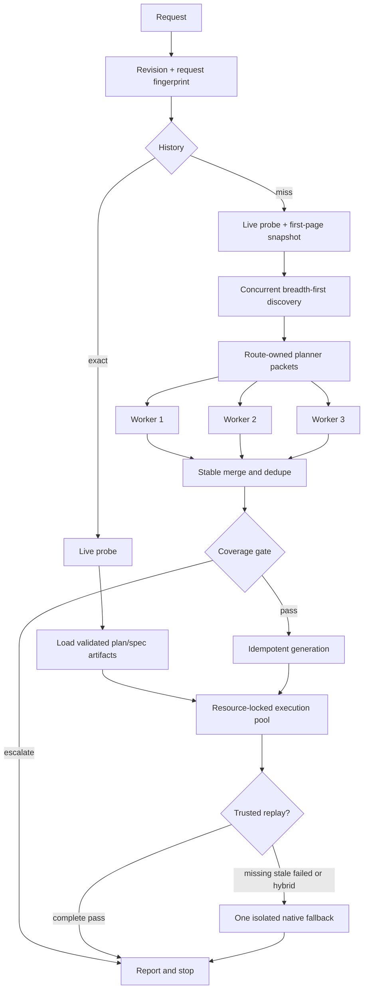

# Current orchestration structure

This document is the implementation-level reference for the optimized
autonomous-QA workflow. It describes the code on
`codex/agent-orchestration-optimization`, what runs in parallel, the exact
context handed to each capability, and which artifacts are reused.

For the audit findings, before/after measurements, and raw benchmark links,
see [Optimized agent orchestration](optimized-agent-orchestration.md).

## 1. Runtime topology

The runtime is deterministic coordination code. It does not create provider
agents, call a model, or read a provider API key. The host may inject planner
and native-UI capabilities; every response is admitted through a schema or a
semantic guard before it can affect persisted state.

```text
CLI / installed SKILL.md
  ├─ history query ───────────────┐
  ├─ orchestrate                 │
  └─ run / run-last              │
                                  ▼
orchestrator.js ── history.js ── .qa history
  ├─ planner.js                  crawl + deterministic fallback
  ├─ planner-agent.js            route partition + capability fan-out
  ├─ coverage.js                 independent deterministic critic/gate
  ├─ generator.js                semantic specs + locator/replay artifacts
  ├─ replay.js                   trusted Playwright first, native fallback once
  ├─ execution.js                fixtures, steps, healing, design, evidence
  ├─ storage.js                  validation, atomic writes, deterministic pointer
  ├─ reporter.js                 report JSON/Markdown
  └─ trace.js                    redacted JSONL decision record
```

The main source responsibilities are:

| Module | Current responsibility |
|---|---|
| `src/history.js` | Canonical request fingerprinting, exact orchestration lookup, same-origin semantic spec lookup, replay metadata and required-variable discovery. |
| `src/orchestrator.js` | Admission, memory-first routing, stage timing, bounded scheduling, resource locks, deterministic aggregation, exit codes. |
| `src/planner.js` | HTML normalization, authenticated concurrent breadth-first discovery, deterministic plan fallback, PRD parsing. |
| `src/planner-agent.js` | Neutral planner contract, compact evidence packets, route ownership, PRD assignment, up-to-three-way fan-out, validation/repair, stable merge. |
| `src/coverage.js` | Provenance-blind deterministic critique and gate. |
| `src/generator.js` | Target-isolated semantic specs, private plan-detail sidecars, conservative preflight, idempotent replay generation. |
| `src/replay.js` | Source-hash admission, exact checkpoint coverage, three-pass promotion, one live trusted replay, lazy native fallback. |
| `src/execution.js` | Native semantic execution and failure-only access to exact-step target history. |
| `src/storage.js` | Contract validation, atomic artifact writes, retention, and one post-join last-result selection. |

## 2. Exact dispatch algorithm

### 2.1 Skill-level request routing

Every natural-language request starts with:

```text
history query(objective, target, auth scope, application revision)
  ├─ recommendedSpecId
  │    └─ bind only required ${VARIABLE} handles
  │       └─ run the existing semantic spec
  │          └─ trusted replay executes live once
  │             └─ persist and audit a new verdict
  └─ no executable recommendation
       └─ enter cold orchestration
```

A semantic recommendation is executable only when it is from the same target
origin, has sufficient two-sided lexical overlap, has a source-matched trusted
replay, and its latest result is `passed` or `healed`. Similarity never copies a
historical verdict.

### 2.2 `orchestrate()` routing

In source order, `orchestrate()` does the following:

1. Admit the URL and create a collision-resistant orchestration ID.
2. Resolve the application revision. Git worktree content, including staged,
   unstaged, and non-ignored untracked files outside `.qa/`, participates.
3. Create the complete history request and search before network discovery.
4. Probe the exact requested URL. A successful cold probe body becomes the
   first crawl page, avoiding another request.
5. On an exact history hit, load and validate the frozen plan, gaps, specs, and
   replay states. Skip crawl, planning, gate reconstruction, and generation.
6. On a miss, crawl, partition evidence, plan, merge, gate, and generate.
7. Stop before execution when the gate escalates or `--plan-only` was used.
8. Execute the selected spec IDs through the bounded resource scheduler.
9. Persist each result without racing `.qa/last-test.json`; after all workers
   join, select one deterministic final run atomically.
10. Build the report, append final timing/history events, and close the tracer
    in `finally`.



## 3. Parallel execution model

Parallelism is introduced only across work without an ordering dependency.

| Layer | Partition key | Default / maximum | Ordering and safety rule |
|---|---|---:|---|
| Discovery | Same BFS depth | 4 / 8 | Requests share the established cookie snapshot. Responses are restored to queue order before links are enqueued. |
| Planning | First route segment ownership | 3 / 3 | Identical neutral instructions; each PRD clause goes to one best evidence owner; merge order is stable. |
| Spec execution | Spec plus application resource | 3 / 8 | Requires an executor factory/fresh context, or replay-only work with no shared native fallback. |
| Shared mutations | `shared-mutable-application` | 1 | Fixtures and destructive intents such as checkout, create, delete, payment, registration, or submission serialize. |

The scheduler uses two independent controls:

- a global semaphore bounds active work; and
- a promise tail per resource serializes only jobs sharing that resource.

A job waiting on a resource lock does not occupy a global execution slot. Output
is written into its original index, so completion timing cannot reorder the
report. A shared executor forces concurrency to one; when an executor factory
is present it takes precedence and must return a fresh context.

These operations deliberately remain serial:

- steps and expectations inside one spec;
- fixture setup, between-step fixtures, and cleanup;
- a failure-only healing retry;
- design comparison at its declared checkpoint;
- the three isolated replay-promotion validations; and
- final report and last-result pointer commits.

## 4. Planner context engineering

Every planner call receives one immutable envelope. The runtime no longer sends
the brief and duplicate raw `siteMap`, prompt, and PRD objects.

```json
{
  "contractVersion": 2,
  "taskId": "surface-1",
  "parentId": "orchestration",
  "deadlineMs": 30000,
  "inputHash": "sha256-of-brief",
  "immutable": true,
  "brief": "{ bounded JSON evidence packet }",
  "instructions": "neutral evidence-grounded contract",
  "schemaId": "plan-draft.schema.json",
  "schema": "compact wire schema",
  "evidenceRefs": ["route:12-hex-digest"]
}
```

The JSON inside `brief` contains only:

- an explicit untrusted-data boundary;
- normalized objective and auth provenance;
- the owned route list and compact cross-route edges;
- bounded titles, headings, links, forms, input names/types, and state signals;
- PRD clauses assigned to this evidence owner; and
- names-only `${QA_*}` references available to the worker.

It excludes resolved secrets, raw HTML, screenshots, traces, prior plans,
scores, verdicts, unrelated PRD clauses, full conversation history, and worker
personas. Every string/list has a field cap and the complete packet has a
60,000-character fail-closed boundary.

Planner output is accepted only when:

1. it satisfies the bounded, kind-specific `plan-draft.schema.json` contract;
2. it contains at least one flow;
3. sensitive inputs use one of the supplied reference names; and
4. it survives normalization without invented assertion fields.

One repair turn receives only the validation issues and a rejected-draft
preview capped at 20,000 characters. A second rejection falls back to the
deterministic planner with the reason preserved.

## 5. Memory and invalidation boundaries

There are three deliberately separate notions of reuse:

| Reuse layer | Compatibility identity | What is reused | What still runs live |
|---|---|---|---|
| Exact orchestration | Target origin, normalized objective terms, PRD hash, planner mode, crawl limits, auth scope, app revision, and all prompt/crawler/generator/schema versions | Validated plan, gaps, spec IDs, and matching replay artifacts | Readiness, execution, audit, result and report |
| Semantic recommendation | Same origin, two-sided term score, source-matched trusted replay, latest clean result | Existing semantic spec and replay | Complete live replay and new verdict |
| Trusted replay | Semantic spec, environment, fixtures, generator version, source hash, script hash, three validation passes | Playwright program | Browser launch, actions, assertions, errors, persistence |

An unresolved application revision receives a unique nonce, so two unknown
states can never exact-hit accidentally. A changed plan contract invalidates
exact orchestration reuse without invalidating an independently source-matched
trusted replay. Replay failure marks the artifact rejected and falls through
once; it never returns an old pass.

## 6. Current artifact structure

```text
.qa/
├── environments.yaml
├── last-test.json
├── fixtures/
├── specs/
│   ├── <target-hash>-<flow>.yaml              canonical semantic contract
│   ├── <target-hash>-<flow>.playwright.mjs    import-free replay
│   └── <target-hash>-<flow>.playwright.json   replay trust/source manifest
└── runs/
    ├── run_<date>_<time>_<suffix>/
    │   ├── result.json
    │   └── screenshots/
    └── orchestrations/
        └── orch_<epoch>_<suffix>/
            ├── request.json                   exact-history manifest
            ├── site-map.json
            ├── test-plan.json
            ├── test-plan.md
            ├── gaps.json
            ├── gaps.md
            ├── trace.jsonl
            ├── report.json
            ├── report.md
            ├── report.yaml
            └── generated/
                ├── _resolve.js
                ├── _auth.js                   only when authentication is needed
                ├── <spec>.locators.json       plan details + mechanical bindings
                └── <spec>.spec.js             portable generated Playwright test
```

Target-derived prefixes prevent two origins from generating the same spec or
environment ID. `request.json` is the lookup index for exact history. Semantic
search reads validated specs, environments, replay manifests, and latest
results in parallel; it does not ingest raw traces into a prompt.

## 7. What changed and why it is faster

| Previous behavior | Exact optimization | Result |
|---|---|---|
| Every request crawled and planned again | History is resolved before discovery | Exact repeats remove crawl, planner, gate reconstruction, and generation. |
| Readiness and crawl fetched the first page independently | Probe body seeds crawl | Removes one request, or more on auth-gated entry pages. |
| BFS fetched every route serially | Same-depth bounded batches | Independent network latency overlaps while evidence order stays deterministic. |
| One broad planner prompt duplicated raw objects | Route-owned compact packets | Smaller per-worker context and less anchoring/prompt-injection surface. |
| Planning was one serial capability call | Up to three concurrent owners | Independent application surfaces are explored concurrently. |
| Shared page and result pointer blocked safe concurrency | Fresh executor factories, resource locks, non-selecting writes | Independent specs overlap without browser-state or pointer races. |
| Generation replaced an already trusted replay | Source-matched trusted state is preserved | Warm runs retain the executable artifact. |
| Replay coverage compared only a count | Exact `(step, expectation)` identity set | Duplicate/missing checkpoints cannot masquerade as complete coverage. |
| Previous target history was global and eager | Same spec/environment/step, failure-only lookup | Less context and no cross-test action bias. |
| Tracing could be bypassed by a custom emitter | Persisted tracer always runs and closes in `finally` | Complete timing and memory/replay decisions are available for audit. |

Measured on the committed 30-pair protocol, the warm path is 71.34% faster
than the untouched baseline repeat. The exact lookup itself is 1 ms median and
2 ms p95. See the benchmark report for the complete sample arrays and hashes.

## 8. Operator controls

| Control | Default | Bound / effect |
|---|---:|---|
| `--concurrency` | 3 | 1–8 spec workers; safety may reduce effective concurrency to 1. |
| `--planning-concurrency` | 3 | 1–3 route-owned planner workers. |
| `--crawl-concurrency` | 4 | 1–8 same-depth fetches. |
| `--no-history` | off | Forces a cold lookup miss while still writing a future history manifest. |
| `--app-revision <id>` | `auto` | Explicit invalidation identity for non-Git or externally versioned apps. |
| `history query --authenticated` | anonymous | Separates authenticated and anonymous recommendations. |

## 9. Safety boundary

Parallelism does not broaden authority. Remote targets still require explicit
admission; resolved secrets never enter planner packets or persisted replay
source; application code is not modified during QA; expectations remain frozen
during healing; and no historical result is accepted as the current verdict.

The scheduler coordinates one orchestration process. Two independent processes
targeting the same mutable backend still require an external project/account
lock or unique test data.
