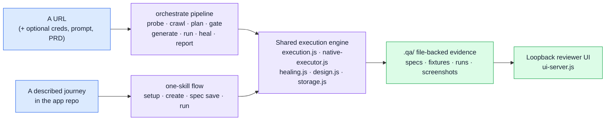

# 00 — System overview

> Deep-dive documentation set for the `auto-qa` repository. Written to be lifted
> straight into slides. Every claim below is traceable to a file in this
> repository; where something is aspirational or unfinished, it says so.

---

## 1. What this repository actually is

Two products that share one execution engine and one set of contracts:

| # | Product | Entry point | Input | Output |
| --- | --- | --- | --- | --- |
| 1 | **Autonomous test-orchestration agent** | `qa-agent orchestrate --url <url>` | A URL (only required input); optional credentials, natural-language prompt, PRD file | A crawled site map, a synthesized test plan, a scored coverage-gate result, generated Playwright artifacts, executed semantic runs, a triaged report (`report.json` / `report.md`), and a full decision trace (`trace.jsonl`) |
| 2 | **One-skill developer experience** | `$autonomous-qa <natural language>` (installed Codex/Claude skill) | A described user journey inside the developer's own application repository | Selector-free semantic YAML specs, native-browser execution, screenshots and evidence under `.qa/runs/`, a loopback results UI |

They are not two codebases. `orchestrate` reuses the skill's execution engine:
`generate()` writes specs into the same `.qa/` workspace and `orchestrator.js`
calls the same `executeRun()` the one-skill path uses
([src/orchestrator.js](../../src/orchestrator.js)).



---

## 2. The single strongest design idea

**The runtime ships rails; the host agent brings judgement.**

The Node runtime never calls a language model. It contains no provider client,
reads no API key, and makes no outbound request except to the target under test
(`SKILL.md` → Safety invariants; verified — `grep -i llm src/` returns nothing,
and `package.json` production dependencies are exactly `ajv` + `yaml`).

Everywhere judgement is needed, the runtime defines a **capability contract** and
accepts an injected implementation:

| Seat | Contract | Injected as | Deterministic fallback |
| --- | --- | --- | --- |
| Planner | `async ({brief, instructions, schema, siteMap, prompt, prd, feedback}) => draft`, validated against `plan-draft.schema.json` | `planner` option, or `--plan <file>` | `buildTestPlan()` in [src/planner.js](../../src/planner.js); reason recorded in `plan.source.fallbackReason` |
| UI driver | `NativeExecutor` — `act` / `observe` / `screenshot` (+ optional `rediscover`, `recover`, `waitFor`, `compareDesign`, `consoleErrors`, `networkErrors`, `connect`, `close`) | `executor` option | **None** — reports `blocked` with the missing-capability reason |
| Healer | `rediscover()` must return an *explicitly equivalent* target | part of the executor | **None** — no equivalence, no heal |
| Design comparator | `compareDesign(request, ctx)` returning structured findings | part of the executor | **None** — `not_checked` → blocked |

Consequence for the pitch: *the pipeline never breaks for want of a model, and it
never pretends a model was there.* Every artifact records which path was taken —
`plan.source.planner` is `"deterministic"` or `"agent"` in every emitted
`test-plan.json` and `report.json`.

---

## 3. Repository map

```
auto-qa/
├── src/                              # 25 modules, the whole runtime (~4,700 LOC)
│   ├── orchestrator.js               # the meta-agent: stage sequencing, exit codes
│   ├── planner.js                    # fetch-only crawl + deterministic plan synthesis
│   ├── planner-agent.js              # Planner sub-agent protocol (brief · review · fallback)
│   ├── coverage.js                   # 12-rule coverage gate, scoring, verdict
│   ├── generator.js                  # plan → semantic specs + Playwright artifacts + fetch preflight
│   ├── execution.js                  # the semantic execution engine (852 LOC, the core)
│   ├── healing.js                    # conservative self-healing decision machine
│   ├── locator-chain.js              # strategy ordering + defect triage table
│   ├── native-executor.js            # the capability contract for UI drive
│   ├── design.js                     # explicit-reference design comparison
│   ├── environment.js                # app startup / reuse / process-tree teardown
│   ├── storage.js                    # the .qa/ workspace: atomic, validated, guarded (664 LOC)
│   ├── schema-validator.js           # ajv compilation of 10 contracts
│   ├── references.js                 # ${SECRET} resolution + recursive redaction
│   ├── reporter.js                   # report.json / report.md + PRD-gap analysis
│   ├── trace.js                      # JSONL decision tracer with redaction + degraded mode
│   ├── ui-server.js                  # loopback reviewer HTTP API (405 LOC)
│   ├── cli.js                        # 20 commands (568 LOC)
│   ├── playwright-executor.js        # dev/demo-only reference NativeExecutor (never bundled)
│   └── …                             # draft, documents, errors, samples, index, skill-runtime
├── schemas/                          # 10 JSON Schema contracts — the authoritative source
├── .agents/skills/autonomous-qa/     # the installable skill package (self-contained)
│   ├── SKILL.md                      # the agent-facing contract (158 lines)
│   ├── runtime/qa-agent.mjs          # esbuild bundle of src/ + ajv + yaml (19.7k lines)
│   ├── schemas/  ui/                 # copied authoritative assets
│   └── scripts/                      # POSIX launcher, Windows .cmd launcher, node entry
├── ui/                               # the loopback reviewer front end (index.html, app.js, styles.css)
├── demo-app/                         # standalone deterministic app under test (zero QA deps)
├── test/                             # 31 files, 192 tests
├── test-support/                     # fake-fetch harness, recorded fixtures, demo executor
├── scripts/                          # build-skill-package.mjs, run-with-playwright.mjs
├── docs/                             # architecture, PRD, corner cases, orchestrator demo, explain/
└── phases/                           # the 5-phase implementation roadmap (all complete)
```

---

## 4. Measured status (reproduced 2026-09-05 at `d8199ad`, Windows 11 / Node 20)

| Metric | Value | How |
| --- | --- | --- |
| Test suite | **192 tests · 191 pass · 0 fail · 1 skipped** | `node --test` (the skip needs symlink privileges) |
| Line coverage | **96.64 %** | `node --test --experimental-test-coverage` |
| Branch coverage | **82.77 %** | same |
| Function coverage | **95.56 %** | same |
| Production dependencies | **2** (`ajv`, `yaml`) | `package.json` |
| Schemas | **10** | `schemas/` |
| Coverage-gate rules | **12** (6 blocking / 6 advisory) | `COVERAGE_RULES` |
| CLI commands | **20** | `cli.js` HELP text |
| Result classifications | **5** | `result.schema.json` |
| Run retention | **20 per spec** | `MAX_RECENT_RUNS_PER_SPEC` |

> **Honesty note for the deck.** `README.md` states the coverage gates are
> 100 % lines / 95 % branches / 98 % functions. The measured numbers above are
> below all three, so `npm run test:coverage` currently fails its own thresholds
> even though `npm test` is fully green. Say *"192 tests green; branch-coverage
> gate deliberately not yet met"* rather than claiming the gates pass.

> **Current tree.** These docs describe `d8199ad` (merge of PR #3, `exp_1`) plus
> the uncommitted working-tree changes to `README.md`, `TODO.md`,
> `docs/architecture.md`, `src/orchestrator.js`, `src/reporter.js`,
> `src/schema-validator.js` and the three new orchestrator schemas. The PR #3
> merge changed the deterministic planner substantially — see
> [10 §0](10-gaps-and-roadmap.md) for what that closed.

---

## 5. The correctness contract in one table

| Classification | Meaning | Guard that enforces it |
| --- | --- | --- |
| `passed` | Every declared expectation passed with no recovery | `HEALING_CLASSIFICATION_MISMATCH` rejects a `passed` run that hides a heal |
| `healed` | Interaction mechanics drifted, **one** equivalent retry worked, and the original expectations passed **byte-for-byte unchanged** | `createExpectationGuard`, `HEALED_WITHOUT_RECOVERY`, `MISSING_HEALING_EVIDENCE` (before **and** after screenshots required) |
| `functional_regression` | An action or a required visible outcome failed. The expectation is never rewritten | `classifyFailure` returns it whenever verification still fails |
| `design_regression` | Functionality passed **and** an explicit reference plus an actual screenshot support concrete findings | `UNSUPPORTED_DESIGN_REGRESSION`, `DESIGN_REGRESSION_WITH_FAILED_STEP` |
| `blocked` | Environment, fixture, credential, native capability, or declared comparison could not proceed reliably | `detectNativeCapability`, `DESIGN_NOT_CHECKED` |

Healing **may**: rediscover a moved or renamed control, open a newly introduced
menu, wait on observable readiness.
Healing **may not**: change expected copy, business outcomes, success/error
states, accessibility requirements, fixture postconditions, or design baselines.

> One-line version for a slide: **the model may re-locate; it may never re-assert.**

---

## 6. Explicit scope boundaries (deliberately *not* built)

Stagehand · selector scripts · coordinate scripts · fixed sleeps · headless CI ·
scheduling · parallel or browser-matrix execution · production testing ·
databases · remote UI hosting · multi-user auth · automatic baseline updates ·
pixel-perfect visual diffing.

Playwright is a **devDependency only**. Generated `.spec.js` files are portable
artifacts for the developer's own runner; `src/playwright-executor.js` is never
bundled (the shipped runtime stays `ajv` + `yaml`).

---

## 7. Reading order for the rest of this set

1. [01 — Harness architecture](01-harness-architecture.md) — the runtime, its modules, contracts and invariants.
2. [02 — Skill package design](02-skill-design.md) — how the runtime becomes a one-install skill.
3. [03 — Agents, sub-agents and task decomposition](03-agents-and-subagents.md) — the agentic model.
4. [04 — Orchestration pipeline, stage by stage](04-orchestration-pipeline.md) — the eight stages in detail.
5. [05 — Execution, healing, design and safety](05-execution-healing-safety.md) — the engine and its guards.
6. [06 — Storage, schemas and evidence](06-storage-schemas-evidence.md) — the file-backed contract.
7. [07 — UI, CLI and developer surface](07-ui-cli-surface.md) — everything a human touches.
8. [08 — Testing, verification and the demo apparatus](08-testing-and-demos.md) — how it proves itself.
9. [09 — Slide-by-slide deck outline](09-presentation-outline.md) — ready-to-build PPT.
10. [10 — Known gaps and roadmap](10-gaps-and-roadmap.md) — what to say when asked "what's missing?"
