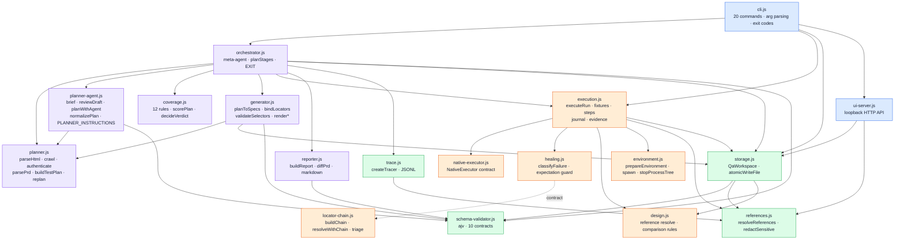
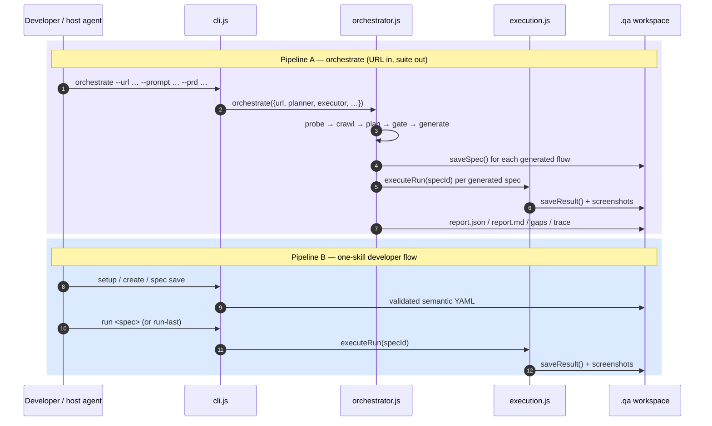

# 01 — Harness architecture

The "harness" is the Node runtime in `src/`: 25 ES modules, two production
dependencies, zero network egress except to the target under test. This document
explains every module, the contracts between them, and the invariants that make
the whole thing trustworthy.

---

## 1. Module map and dependency direction



**Direction rule:** foundation modules (`storage`, `schema-validator`,
`references`, `documents`, `errors`, `trace`) never import upward. `execution.js`
never imports `orchestrator.js`. `skill-runtime.js` — the bundle entry point —
re-exports `index.js` plus `runCli`, and deliberately does **not** import
`playwright-executor.js`, which is why the shipped bundle has no Playwright
reference at all.

---

## 2. Module-by-module reference

### `src/errors.js` — the error taxonomy
- `QaError(code, message, issues[], options)` — every failure in the system is a
  coded error carrying **path-based issues** (`{ path: "$.steps[0].expect", message }`).
- `formatQaError()` renders `message [CODE]` plus an indented issue list — this is
  what the CLI prints and what the UI turns into HTTP status codes.
- `ORCHESTRATION_ERROR_CODES` freezes the seven orchestration-level codes:
  `ORCHESTRATION_TARGET_UNREACHABLE`, `ORCHESTRATION_AUTH_FAILED`,
  `ORCHESTRATION_REMOTE_BLOCKED`, `PLAN_EMPTY`, `COVERAGE_ESCALATED`,
  `GENERATION_UNVALIDATED`, `TRACE_WRITE_FAILED`.

> Design point: errors are *data*, not strings. The UI maps codes to HTTP status
> (404 / 405 / 409 / 413 / 422 / 500) without string matching.

### `src/documents.js` — YAML/JSON boundary
- `parseYaml` uses `yaml`'s `parseDocument` with `strict: true`, `uniqueKeys: true`,
  and `maxAliasCount: 100` (billion-laughs protection). Errors are converted to
  `$ (line N, column M)` issues.
- `stringifyYaml` pins `lineWidth: 0` so saved YAML never re-wraps and diffs stay clean.
- `parseJson` / `stringifyJson` mirror it; `stringifyJson` always appends a newline.

### `src/schema-validator.js` — the contract compiler
- Compiles **10** schemas at module load with `Ajv({ allErrors: true, strict: true })`:
  `environments`, `fixture`, `spec`, `result`, `lastTest`, `testPlan`, `planDraft`,
  `siteMap`, `gaps`, `report`.
- `propertyPath()` converts ajv `instancePath` into JSONPath-ish `$.steps[0].expect`;
  `required` and `additionalProperties` errors get the offending key appended.
- Filters the generic trailing `"must match exactly one schema in oneOf"` noise.
- `isStableId` / `assertStableId` enforce `^[a-z][a-z0-9]*(?:-[a-z0-9]+)*$` — this
  is simultaneously an ID policy **and** a path-traversal guard, because IDs become
  filenames.

### `src/references.js` — secrets in, secrets never out
- `REFERENCE = /^\$\{([A-Z][A-Z0-9_]*|outputs\.[A-Za-z][A-Za-z0-9_.-]*)\}$/` — only
  a whole-string reference resolves, so a template cannot smuggle a secret into prose.
- `outputs.*` walks earlier run outputs with `__proto__` / `constructor` / `prototype`
  blocked at every segment.
- Any resolved value is marked **sensitive** and added to a redaction set.
- `redactSensitive()` walks recursively, replaces longest-secret-first, skips
  `Buffer`s (screenshots), and **never rewrites** `IMMUTABLE_CONTRACT_FIELDS`
  (`runId`, `specId`, `environment`, `fixtureId`, `phase`, `type`, `status`,
  `intent`, `expectation`) — so redaction can never silently corrupt the contract
  it is protecting.

### `src/trace.js` — the decision log
- `createTracer({ now, writeLine, sensitiveValues })` returns `emit(stage, event, payload)`.
- Every entry: `{ seq, ts, stage, event, level, message, data? }` — monotonic `seq`,
  ISO timestamp, redacted before serialization.
- **Degraded mode**: if `writeLine` throws, the tracer sets `degraded = true` and
  buffers in memory rather than failing the run. Tracing never takes the pipeline down.
- Written as JSONL to `<orchestration>/trace.jsonl` with `flag: "a"`.

### `src/storage.js` — the `.qa/` workspace
See [06 — Storage, schemas and evidence](06-storage-schemas-evidence.md) for the
full invariant list. Headline mechanics:
- `atomicWriteFile()` — write to `.<name>.<pid>.<uuid>.tmp` with `wx` mode `0600`,
  `fsync`, then `rename`. On any error: close handle, unlink temp, throw
  `ATOMIC_WRITE_FAILED`. A crash can never leave a half-written spec.
- `QaWorkspace` owns every path: `environmentsPath`, `fixturesDirectory`,
  `specsDirectory`, `runsDirectory`, `lastTestPath`.
- Path builders validate before they build: `specPath`/`fixturePath` call
  `assertStableId`; `resultPath` enforces `^run_[0-9]{8}_[0-9]{6}(?:_[a-z0-9]+)?$`;
  `screenshotPath` enforces `^[a-z0-9][a-z0-9-]*\.(png|jpe?g|webp)$`.
- Referential integrity in both directions: saving an environments file fails if a
  spec still references a removed environment (`ENVIRONMENT_IN_USE`); deleting a
  fixture fails if a spec references it (`FIXTURE_IN_USE`); deleting the selected
  spec fails (`SPEC_SELECTED`).

### `src/environment.js` — the app under test
- `prepareEnvironment()`: desktop targets pass through untouched; web targets are
  URL-validated (`http`/`https` only), probed with a **1-second** `AbortSignal.timeout`,
  reused if healthy, otherwise started via `startCommand` and polled until reachable
  with a **15-second** default deadline (250 ms tick).
- `spawnApplication()` uses `shell: true`, detached on POSIX, `unref`'d.
- `stopProcessTree()` is a genuine cross-platform fix, not a shim: POSIX signals the
  negative pid (whole process group); Windows uses `taskkill /pid <n> /T /F` because
  `shell: true` means the direct child is `cmd.exe` and killing it **orphans the dev
  server holding the port**. Exit status 128 ("already gone") is treated as success.

### `src/native-executor.js` — the capability contract
```
REQUIRED: act(intent, ctx) · observe(expectation, ctx) · screenshot(ctx)
OPTIONAL: isAvailable · connect · rediscover · recover · waitFor
          compareDesign · consoleErrors · networkErrors · close
```
- `NativeExecutor` is a thin wrapper with `kind` of `"web"` or `"desktop"`.
- `availability()` reports missing required methods **by name**, and lists
  `unsupported: ["console inspection", "network inspection"]` when those optional
  hooks are absent — missing capability is *declared*, never silently assumed to pass.
- `supports(op)` is a plain `typeof === "function"` check, used by healing to decide
  whether rediscovery or readiness waiting is even possible.
- `recover()` falls back to `act(intent, { ...ctx, recovery: { target } })` if the
  driver has no dedicated recover method.
- `detectNativeCapability(environment, executor)` returns `available: false` with a
  human sentence for: no executor at all, kind mismatch (web env + desktop driver),
  or an executor with no `availability` method.

### `src/locator-chain.js` — strategy order and defect triage
- `STRATEGY_ORDER = ["testid", "role", "label", "text", "css"]` — accessibility-first,
  CSS last.
- `buildChain()` sorts by that rank and de-duplicates on `strategy:JSON(value)`.
- `resolveWithChain({ candidates, probe })` walks the chain, records every attempt
  with `ok`, returns the first resolution.
- `triage()` is the **defect classification table**:

  | Condition | Classification | Confidence |
  | --- | --- | --- |
  | Expectation guard tripped (`EXPECTATION_MUTATED`) | `app_defect` | **1.0** |
  | No chain to probe | `environment` | 0.6 |
  | Resolved after >1 attempt (primary failed, fallback worked) | `broken_locator` | 0.9 |
  | Chain exhausted, target unreachable / HTTP 0 | `environment` | 0.95 |
  | Chain exhausted with 4xx/5xx or console/network errors | `app_defect` | 0.85 |
  | Chain exhausted after prior attempts | `flaky` | 0.6 |
  | Chain exhausted, no other signal | `app_defect` | 0.7 |
  | Resolved on retry with identical locator | `flaky` | 0.8 |
  | Single-strategy resolution | `broken_locator` | 0.7 |

  > **Known gap, be honest about it:** `triage()` is unit-tested
  > (`test/orchestrate.test.js`) and drawn in `docs/architecture.md`, but
  > `orchestrator.js` currently computes its own inline triage
  > (`failed → app_defect`, `blocked → environment`, healed → `broken_locator`,
  > else `none`). The richer table is not yet wired into the report. Logged as
  > TODO 0.6.

---

## 3. Cross-cutting invariants (the things that make it credible)

| # | Invariant | Where enforced |
| --- | --- | --- |
| I1 | Every document that is written is schema-valid first | `validateDocument` before every `atomicWriteFile`; `reporter.writeReport` validates `report`; `orchestrator` validates `siteMap`, `testPlan`, `gaps` |
| I2 | A schema failure on an orchestration artifact warns in the trace, it does not silently ship a malformed file | `orchestrator.js` `site_map_invalid` / `plan_invalid` / `gaps_invalid`; `reporter.js` `report_invalid` |
| I3 | Every write is atomic | `atomicWriteFile` (temp + fsync + rename) |
| I4 | Every ID is a validated slug before it becomes a path | `assertStableId` in `specPath` / `fixturePath` / `listResults` |
| I5 | Resolved secrets never reach YAML, JSON, trace, terminal or screenshots | `resolveReferences` + `redactSensitive` at journal, result, trace and CLI boundaries |
| I6 | Expectations are byte-for-byte immutable through a run | `createExpectationGuard` in healing; `RESULT_EXPECTATION_CHANGED` in `saveResult` |
| I7 | The UI binds to loopback only | `assertUiAddress` allows `127.0.0.1`, `localhost`, `::1` only |
| I8 | Remote orchestration targets need an explicit flag | `assertTargetAllowed` throws `ORCHESTRATION_REMOTE_BLOCKED` |
| I9 | Missing capability is declared, never assumed | `detectNativeCapability`, `evidence.unsupported[]` |
| I10 | A run only claims `healed` with before **and** after screenshots on disk | `execution.js` downgrade to blocked + `MISSING_HEALING_EVIDENCE` in storage |

---

## 4. Exit-code contract

`EXIT` in [src/orchestrator.js](../../src/orchestrator.js):

| Code | Name | Meaning |
| --- | --- | --- |
| 0 | `OK` | Clean run |
| 10 | `DEFECTS` | At least one scenario failed → `verdict: defects_found` |
| 11 | `ESCALATED` | Gate escalated, or the report verdict is `incomplete` (blocked/skipped scenarios) |
| 12 | `UNVALIDATED` | Nothing generated or nothing validated; also returned by `--plan-only` |
| 20 | `UNREACHABLE` | `ORCHESTRATION_TARGET_UNREACHABLE` / `ORCHESTRATION_AUTH_FAILED` |
| 30 | `USAGE` | Bad CLI usage (also used by `scripts/run-with-playwright.mjs` for missing deps) |
| 40 | `INTERNAL` | Any other `QaError` |

The verdict itself is computed in `reporter.buildReport`:
`failed > 0 → defects_found (10)`; else blocked>0 or everything skipped →
`incomplete (11)`; else `clean (0)`. `orchestrator` then upgrades a clean report to
`ESCALATED` if the gate escalated.

`ORCHESTRATION_REMOTE_BLOCKED` is the one error that **re-throws** rather than
becoming an exit code — refusing to touch a remote host is a hard stop, not a result.

---

## 5. Two pipelines, one engine



Pipeline B has **no crawl, no plan, no gate, no generator** — a human (or the host
agent acting on their words) authored the intent directly. Both converge on
`executeRun`, which is why the classification taxonomy, healing rules, evidence
model and audit checklist are identical for both.

---

## 6. What "harness" buys you, stated plainly

1. **Determinism where determinism is cheap.** Crawling, scoring, path handling,
   validation, redaction, and file writing are all deterministic and unit-tested.
2. **Judgement where judgement is required.** Planning, target rediscovery and
   design comparison are capability seats, filled by whoever is hosting.
3. **Refusal instead of guessing.** Every seat has an explicit "capability absent"
   path that reports `blocked` with a reason rather than inventing an outcome.
4. **Everything on disk, everything validated.** No database, no hidden state; the
   artifacts a judge reads are the same artifacts the system reads back.
