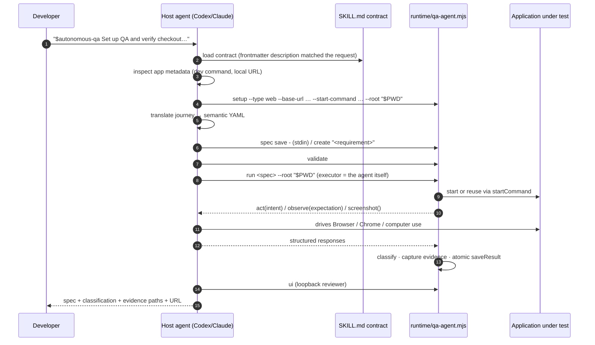

# 02 — Skill package design

> Historical presentation snapshot. The current compressed `SKILL.md`,
> memory-first routing, and capability context are documented in
> [Current orchestration structure](../current-orchestration-structure.md).

How a Node runtime becomes a **one-install skill** that a coding agent (Codex or
Claude) can operate on the developer's behalf, without the developer ever adding
a QA dependency to their own project.

---

## 1. The product claim being engineered

> Install one skill. Open your application repository. Describe the journey.
> Everything else — setup, app startup, browser drive, evidence, reruns, the
> results UI — belongs to the skill.

That claim implies four hard engineering constraints:

| Constraint | Why | How it is met |
| --- | --- | --- |
| The skill must be **self-contained** | The app project must not gain `node_modules` or a QA package | `esbuild` bundles `src/` + `ajv` + `yaml` into a single `runtime/qa-agent.mjs` |
| It must **not import the dev repo** | The skill is copied elsewhere on install | `skill-runtime.js` is the only entry; the packaging test copies the skill to a separate directory with **spaces in the path** and runs it from an external CommonJS project |
| It must run **everywhere** | Windows developers exist | Three launchers: POSIX `qa-agent`, Windows `qa-agent.cmd`, and launcher-free `node scripts/qa-agent.mjs` |
| It must be **legible to an agent** | The agent, not a human, drives it | `SKILL.md` is a 158-line behavioural contract, not a README |

---

## 2. Anatomy of the installed package

```
.agents/skills/autonomous-qa/
├── SKILL.md                 # YAML frontmatter (name, description) + the contract
├── runtime/
│   └── qa-agent.mjs         # esbuild ESM bundle, node20 target, ~19.7k lines
├── schemas/                 # 10 authoritative JSON Schemas, copied from schemas/
├── scripts/
│   ├── qa-agent             # POSIX: resolves its own dir, execs node runtime
│   ├── qa-agent.cmd         # Windows: %~dp0.. → node runtime
│   └── qa-agent.mjs         # 4 lines: import { runCli } from "../runtime/qa-agent.mjs"
└── ui/                      # index.html · app.js · styles.css (copied from ui/)
```

`.agents/skills/autonomous-qa/` (Codex convention) is the built, committed,
canonical package. A `.claude/skills/autonomous-qa/` copy with an identical
`SKILL.md` may exist locally for the Claude convention; it is **gitignored**, so
there is exactly one source of truth in the repository.

### The build (`scripts/build-skill-package.mjs`, 33 lines)

```js
build({
  entryPoints: ["src/skill-runtime.js"],
  outfile: ".agents/skills/autonomous-qa/runtime/qa-agent.mjs",
  bundle: true, format: "esm", platform: "node", target: "node20",
  banner: { js: 'import { createRequire } from "node:module"; const require = createRequire(import.meta.url);' },
  sourcemap: false, legalComments: "none",
});
// then: cp schemas/ and ui/ into the skill, recursive + force
```

Three details worth a slide:
- The **`createRequire` banner** exists because `ajv` is CommonJS; bundling it into
  an ESM output needs a `require` shim in scope.
- `schemas/` and `ui/` are **copied, not bundled** — they must remain readable files
  because `schema-validator.js` resolves `../schemas/*.json` relative to
  `import.meta.url`, and `ui-server.js` serves `../ui/*` from disk.
- `npm test` runs `pretest: npm run build:skill`, so **the committed bundle can never
  silently drift from source**.

### `.gitattributes` — a real portability fix
The esbuild bundle is LF. Without pinned EOLs, every Windows build showed the whole
19.7k-line file as modified. `.gitattributes` pins `*.mjs/js/json/yaml/md` to LF,
the POSIX launcher to LF, `qa-agent.cmd` to **CRLF** (a `.cmd` with LF endings
misbehaves in `cmd.exe`), and marks media as binary.

---

## 3. `SKILL.md` — the agent-facing contract

This is the most important non-code artifact in the repository. It is not
documentation for a human; it is the **behavioural specification the host agent
executes**. Its structure:

| Section | What it constrains |
| --- | --- |
| **Developer contract** | Keep the developer in their app repo; never tell them to run `qa-agent`; `$autonomous-qa` natural language is the public interface; don't modify app code while testing |
| **Self-contained runtime** | Resolve `SKILL_ROOT`; always pass `--root "$PWD"`; quote everything (installs land in paths with spaces); never resolve files outside `SKILL_ROOT` |
| **First request in an application** | 7 numbered steps: inspect project metadata → `setup --type web/desktop` → never seed demo samples → translate journey to semantic YAML (**never** CSS/XPath/coordinates/sleeps) → `create` for one outcome, `spec save` for a journey → fixtures only for genuinely reusable setup, secrets as `${VAR}` → `validate` before opening the target |
| **End-to-end run workflow** | 12 numbered steps covering capability detection, app startup/reuse, fixture ordering (`before` → step → `between.afterStep` → `after`), evidence capture rules (never during credential entry), the one-retry healing rule, readiness waits instead of sleeps, design checkpoint handling, finally-style cleanup, atomic result save, stop only what you started |
| **Autonomous orchestration** | `orchestrate` as the second entry point; the runtime supplies rails and *no judgement*; fall back and record it |
| **Planner sub-agent** | The full protocol (see [03](03-agents-and-subagents.md)) including the assertion rule |
| **Classification boundary** | The 5-way taxonomy, restated so the agent cannot drift from it |
| **Results UI** | When to start it, what it is and is not |
| **Internal document operations** | `spec`/`fixture`/`environment`/`result` subcommands, `edit`, `audit` |
| **Safety invariants** | 10 non-negotiables — the ones worth quoting verbatim on a slide |

### The safety invariants, verbatim-ish
1. Expectations and channels describe observable outcomes and remain unchanged during execution and healing.
2. Resolved fixture secrets never enter documents, results, events, terminal output, or screenshots.
3. Replacements require **explicit semantic equivalence**; similarity is insufficient.
4. Healing requires before/after evidence and unchanged-expectation verification.
5. **Agent taste cannot create a design regression** — explicit reference evidence and concrete findings are required.
6. Do not repair application code, update design baselines, or perform pixel-perfect diffing while running QA.
7. Keep storage file-backed: no database, headless CI, scheduling, parallel runs, Stagehand, DOM-selector scripts, coordinate scripts, or fixed sleeps.
8. The runtime never adds a Playwright dependency and never drives a browser itself.
9. **The runtime never calls a language model** — no provider client, no API key, no outbound request except to the target.
10. A plan draft is validated against `plan-draft.schema.json` before anything is generated from it. *Never widen the schema to accommodate a draft; correct the draft.*

> Slide-worthy: invariant 10 is the anti-pattern most teams fall into. The schema is
> the contract; a model that cannot meet it gets rejected and repaired, not
> accommodated.

---

## 4. How the skill actually gets invoked



The key inversion: **the runtime calls back into the agent**. `executeRun` awaits
`executor.act(...)`, and the agent's implementation of `act` is "drive the real
browser with your native tool and tell me what happened, in this shape."

---

## 5. Why this is a skill and not a library / CLI / service

| Alternative | Why rejected |
| --- | --- |
| npm package the app installs | Adds a dependency, a script, and a version-upgrade problem to every app repo. Directly contradicts the product claim. |
| Hosted service | Needs auth, tenancy, secret custody, and network access to the developer's localhost. Explicitly out of scope. |
| Plain CLI the developer runs | Puts the developer back in the runner-operating business; the point is that they describe outcomes instead. |
| MCP server | Would still need the same contract; a skill keeps the whole thing as **files the agent reads**, which is auditable in a way a live server is not. |

The skill form also gives one thing nothing else does: the **judgement seats can be
filled by the host agent for free**. Native browser control and planning are
capabilities the agent already has; the skill just defines the shape they must
arrive in.

---

## 6. Packaging verification (`test/skill-package.test.js`)

A single test carries the whole "one-install" claim. It:
1. copies `.agents/skills/autonomous-qa/` to a **separate temp directory**;
2. creates an **external CommonJS app project** whose path **contains spaces**;
3. runs `setup` through the installed launcher with `--root` pointing at that project;
4. creates and saves a semantic spec;
5. runs it with a **native executor stub**, producing a real result and evidence;
6. serves the packaged UI from the installed `ui/` assets;
7. asserts the app's `package.json` is **byte-identical** afterwards.

That last assertion is the product promise as an executable test.

---

## 7. Windows portability — four real product bugs, not test noise

Documented in `TODO.md` §3.9; each was found by running the suite on Windows:

| Symptom | Root cause | Fix |
| --- | --- | --- |
| Dev server survived `stop()`, held the port | `child.kill()` killed the `cmd.exe` wrapper and orphaned the server | `stopProcessTree()` with `taskkill /T /F`, status 128 = already gone |
| Design reference could reach out over SMB | `file://example.com/x.png` is a legal **UNC path** on Windows | file URLs naming a host are rejected on **every** platform |
| Skill unusable from a Windows shell | Launcher was `#!/bin/sh` only | added `qa-agent.cmd` + documented the launcher-free `node scripts/qa-agent.mjs` form |
| `edit <spec>` failed with EINVAL | Most Windows editors are `.cmd`/`.bat` shims; Node refuses to spawn them without a shell (CVE-2024-27980) | `shell: true` on win32 only, with the trust boundary documented in code |

Result: **161/162 on Windows** at the time, 191/192 today (one skip needs symlink
privileges). Use this as the "it actually works on a judge's laptop" slide.
