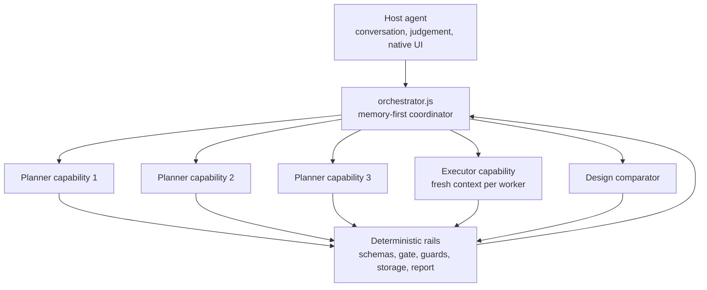

# 03 — Agents, capability seats, and parallel decomposition

This page describes the current optimized implementation. The runtime is a
coordinator and validator; it does not claim that imported functions are
independent model agents.

For field-level packet definitions, see
[Current orchestration structure](../current-orchestration-structure.md).

## 1. Host, runtime, capabilities, and rails



The host may back a capability with a real sub-agent, a native browser tool, or
an injected adapter. The Node runtime itself creates no provider process and
makes no model request. Therefore:

- planner *workers* are concurrent capability calls, not hidden provider agents;
- executor isolation is guaranteed only by an executor factory/fresh context;
- healer and design behavior are optional methods on the executor contract; and
- deterministic fallbacks and blocked outcomes are recorded explicitly.

The governing rule remains: a capability proposes; a deterministic rail admits
or rejects.

## 2. How work is decomposed

The decomposition is evidence-first, not persona-first:

1. Discovery obtains normalized routes, forms, links, headings, and state signals.
2. Routes are grouped by their first path segment into at most three owners.
3. Cross-owner links are retained as compact integration edges.
4. Each PRD clause is assigned to one owner with the strongest factual term
   overlap. Unsupported clauses stay with the gate as visible gaps.
5. Every owner receives the same neutral planner instructions.
6. Workers run concurrently with `Promise.all()`.
7. The runtime merges in stable partition order, removes exact semantic
   duplicates, strips worker provenance, and runs the independent coverage gate.

This avoids anchoring workers as “happy path”, “security”, or “error” personas.
Those labels previously encouraged quota-filling and duplicate plans before the
application evidence was known.

## 3. Planner worker contract

Each invocation receives one immutable envelope:

```text
contractVersion · taskId · parentId · deadlineMs · inputHash · immutable
brief · instructions · schemaId · compact schema · opaque evidenceRefs
```

`brief` is one bounded JSON document containing the objective, auth provenance,
owned routes, integration edges, normalized page facts, assigned requirements,
and names-only secret references. It never contains resolved values, raw HTML,
screenshots, traces, previous verdicts, or the full conversation.

Output must be one `plan-draft.schema.json` object. Kind-specific assertion
fields, list/string bounds, flow/step caps, and sensitive-reference checks are
enforced before normalization. One failed draft may be repaired from bounded
validation feedback; a second failure becomes a recorded deterministic fallback.

## 4. Executor, healer, and design seats

The executor receives one frozen spec, its environment, referenced fixtures,
secret handles, and a fresh context. It does not receive the entire plan or
other specs.

The healer is invoked only after an action failure. It receives the failed
action, immutable expectations, current accessible state, failure evidence, and
at most the prior successful target for the same spec/environment/step. One
explicitly equivalent target may be retried; outcomes and fixture postconditions
cannot be healed.

The design comparator receives only an explicit reference, actual checkpoint
capture, viewport, and fixed rubric. It cannot see or override the functional
verdict.

## 5. Parallelism and serialization

| Work | Parallel | Why |
|---|---|---|
| Same-depth crawl requests | Yes, bounded 4/8 | Independent I/O; queue order restored afterward. |
| Route-owned planner calls | Yes, at most 3 | Disjoint evidence ownership; deterministic merge. |
| Independent specs | Yes, bounded 3/8 | Only with isolated fallback contexts or replay-only execution. |
| Shared/destructive specs | No | Account/cart/order state can race. |
| Steps and fixtures within a spec | No | Each depends on earlier state. |
| Healing | No | Competing recoveries would hide causality. |
| Three replay trust validations | No | Serial fresh runs better expose persistent state leakage. |
| Result pointer/report commit | No | One deterministic final selection. |

The global execution semaphore and per-resource promise tails are separate.
Waiting for a shared resource does not consume a global worker slot.

## 6. Lifecycle visibility

The trace records memory hits/misses, discovery, planner fan-out, draft rejection
or fallback, gate decisions, generation state, replay/native mode, per-spec and
stage durations, and report completion. A custom event callback cannot bypass
the persisted tracer, which closes in `finally`.

The report exposes the planning source and execution mode without presenting
capability names as proof of correctness. Correctness comes from validated
artifacts, live assertions, immutable expectations, and storage guards.
