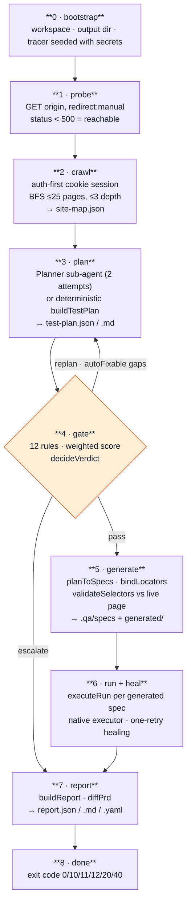

# 04 — The orchestration pipeline, stage by stage

`qa-agent orchestrate --url <url>` — eight stages, zero human input between them.
This document walks each stage: inputs, algorithm, outputs, failure behaviour, and
the artifact it leaves behind.

```bash
node .agents/skills/autonomous-qa/scripts/qa-agent.mjs orchestrate \
  --url http://127.0.0.1:4555 \
  --username demo --password demo \
  --prompt "focus on checkout and authentication" \
  --prd docs/prd.md
```



Artifacts land in `.qa/runs/orchestrations/orch_<epoch>/`:
```
site-map.json  test-plan.json  test-plan.md  gaps.json  gaps.md
report.json    report.md       report.yaml   trace.jsonl
generated/     _resolve.js  _auth.js  <spec>.spec.js  <spec>.locators.json
```

---

## Stage 0 — Bootstrap

| Item | Detail |
| --- | --- |
| Target admission | `assertTargetAllowed(url, {allowRemote})` — parse, protocol whitelist, loopback check |
| Identity | `orchestrationId = orch_<Date.parse(startedAt)>` |
| Workspace | `new QaWorkspace(root).ensureDirectories()` |
| Output dir | `--out` or `.qa/runs/orchestrations/<id>/` |
| Tracer | `createTracer({ now, sensitiveValues: [password, username].filter(len>3), writeLine: append to trace.jsonl })` |
| Trace | `planner_ready` if a planner capability was supplied |

---

## Stage 1 — Probe

```js
const response = await fetchImpl(parsed.origin, { method: "GET", redirect: "manual" });
probeOk = response.status < 500;
```

`redirect: "manual"` matters — an app that 303s `/` → `/login` is **reachable**, not
broken. Anything that throws, or returns 5xx, becomes
`ORCHESTRATION_TARGET_UNREACHABLE` → exit **20**. Trace: `stage_started` /
`stage_completed`.

---

## Stage 2 — Crawl (`crawl()` in `src/planner.js`)

**Fetch-only, no browser.** Deliberate trade-off: portability and speed, at the cost
of client-rendered apps (see gaps).

### Algorithm
1. **Authenticate first, if credentials were supplied.** Fetch the entry path, parse
   its forms, and if a password field exists, POST the login form and capture the
   session cookie *before* the BFS starts. This fixed a real mislabeling bug where
   `/cart` content was actually the login form.
2. **BFS** with a queue of `{path, depth}`, `visited` set, caps `maxPages = 25`,
   `maxDepth = 3`. Cookies roll forward: any `set-cookie` replaces the current jar.
3. **Link normalization** (`normalizePath`) rejects `mailto:`, `#`, `javascript:`,
   absolute/protocol-relative URLs, and binary extensions
   (`png jpg jpeg webp gif svg ico css js woff woff2 map`). Query strings are
   stripped; fragments dropped.
4. Non-OK, non-redirect responses are skipped; fetch exceptions are skipped
   (crawl tolerance, not crawl failure).
5. **Post-crawl auth retry** — if a login page was discovered during the crawl and
   credentials exist, authenticate again and record `auth.authenticated`.
6. **Degradation signal** — `degraded = pages.length > 0 && every page has < 2
   links+forms`, i.e. an SPA shell.

### `parseHtml()` — regex extraction (no DOM)
Extracts `title`, `headings` (h1–h3), `links` (`href` + text), `forms`
(`action`, `method`, `inputs[{name,type,required,placeholder}]`, `buttons[]`), plus
seven boolean **signals**:

| Signal | Heuristic |
| --- | --- |
| `login` | contains "password" **and** "sign in" |
| `checkout` | contains "checkout" or "cart" |
| `payment` | contains "card" or "payment" |
| `search` | contains "search" |
| `list` | contains `<table`, "pagination", or "results" |
| `numeric` | `type="number"` or the word "quantity" |
| `destructive` | contains "delete" or "place order" |

`parseAttributes()` handles quoted, single-quoted and bare attribute values and
skips the tag name itself.

### `authenticate()`
Finds the user field (`text`/`email`/`username`, else any non-password named input,
else `"username"`) and the password field, POSTs
`application/x-www-form-urlencoded` to `form.action || "/login"` with
`redirect: "manual"`, and accepts 200/201/301/302/303/307/308 as success. Anything
else throws `ORCHESTRATION_AUTH_FAILED`. Returns
`{ cookie, authenticated, strategy: "form-post:<action>" }`.

### Output — `site-map.json`
`{ origin, crawledAt, pages[], auth: { authenticated }, degraded }`, validated
against `site-map.schema.json`; a validation failure traces `site_map_invalid`
(warn) rather than aborting.

> **Known gap (verified, shelved):** the crawl records a page under the path it
> *requested*, not the path it *landed on*. On the demo app `/` 303s to `/login`, so
> the site map has a `/` entry carrying `/login`'s form and **no `/login` entry at
> all**. This mis-attributes login flows and makes `bindLocators` fail to find the
> form. Fix is to record `response.url` and keep the requested path as an alias;
> deferred because `test-support/fixtures/` encode the current paths. (`TODO.md` §1.9.)

---

## Stage 3 — Plan

Two paths, one output shape. See [03 — Agents and sub-agents §3](03-agents-and-subagents.md)
for the Planner protocol in full.

- **With a planner capability** — `planWithAgent()`: brief → draft → schema review →
  one feedback-driven repair attempt → normalize, or fall back with a recorded reason.
- **Without** — `buildTestPlan({ siteMap, prompt, prd })`, which stamps
  `source: { planner: "deterministic", fellBack: false }`.

### PRD parsing (`parsePrd`)
Block-based, not line-based: blank lines, bullets, numbered items, markdown
headings and explicit `REQ-*` ids all start a new block; wrapped continuation lines
join. Two guards that came from real bugs:
- a **leading document title** (short, no REQ id, in a doc that uses explicit ids)
  is skipped so it does not steal the `REQ-1` auto-id and shift every requirement;
- duplicate ids are dropped.
Each requirement keeps `{ id, text (≤280 chars), keywords (first 8 words > 3 chars) }`.

### Output
`test-plan.json` (schema-validated, `plan_invalid` warn on failure) and
`test-plan.md` — a human-readable flow list with rationale per flow and an
**Open questions** section.

---

## Stage 4 — The coverage gate (`src/coverage.js`)

The stage that decides whether the plan is worth generating from.

### Governing principles (rebalanced after a real finding)
The file's own header states them:
1. **A rule may only block when it can name an actionable gap.** A blocking failure
   with no gap is a dead end — `decideVerdict` escalates and the replan loop can
   never fire. (This is why replan was never observed in early runs.)
2. **Shape rules are advisory.** A planner that consolidates eleven shallow flows
   into five real journeys is producing a *better* plan while shifting every ratio.
   A ratio rule must not outvote that.

### The 12 rules

| Rule | Severity | Passes when | Emits gaps? |
| --- | --- | --- | --- |
| `happy-path-coverage` | blocking* | every form page has a happy flow | ✅ auto-fixable suggestion per page |
| `error-state-per-form` | blocking* | every **submittable** form page has an error flow | ✅ auto-fixable |
| `auth-negative` | blocking | a login surface has both an invalid-credential and an unauthenticated-redirect flow | ✅ auto-fixable |
| `assertion-presence` | blocking | no flow contains an *observing* step with zero expectations | ✅ hint (not auto-fixable) |
| `checkable-assertions` | blocking | ≥ **80 %** of expectations carry a machine-checkable `assert` predicate | ✅ hint (not auto-fixable) |
| `prompt-honored` | blocking | ≥ **30 %** of flows touch the developer's stated scope | ✅ hint |
| `category-mix` | advisory | happy ≥ 20 %, error ≥ 20 %, some error-or-edge coverage | ✅ hint |
| `journey-depth` | advisory | at least one flow has ≥ 2 steps | ✅ hint |
| `edge-boundary` | advisory | numeric/list pages have edge flows | ✅ auto-fixable |
| `orphan-page` | advisory | every crawled page appears in some flow | ✅ hint |
| `destructive-guard` | advisory | delete/pay/place-order flows verify something | ✗ |
| `prd-coverage` | advisory | every requirement maps to a flow | ✗ |

\* **Self-downgrading**: `happy-path-coverage`, `error-state-per-form` and
`orphan-page` drop to *advisory* when every missing page lies **outside the
developer's stated prompt scope**. The gate must not contradict the prompt the
planner was told to honour.

### `checkable-assertions` — the rule that matters most
> *"An expectation carrying only prose compiles to no assertion — the generator
> emits `// UNVERIFIED` rather than asserting the sentence back at the page. A plan
> of nothing but prose therefore produces a suite that cannot fail, which is worse
> than one that fails loudly."*

It is deliberately **not auto-fixable**: no rearrangement of flows invents an
observable string, so it escalates with a reason instead of burning replan attempts.

Since PR #3 the deterministic planner *does* emit predicates (values lifted from
crawled headings, button labels and link text — see
[03 §3.5](03-agents-and-subagents.md)), reaching **15/21 = 71 %** on the demo app.
Still under the 80 % bar, so the rule still blocks — but now because the remaining
expectations describe page text the crawl never observed, which is exactly the
condition a Planner sub-agent (or the post-execution feedback loop in
[10 §G4](10-gaps-and-roadmap.md)) is needed to resolve.

### Prompt matching — generic, not a topic table
`promptKeywords()` strips a stop-word list and matches the developer's own words
against the plan's own words. The earlier implementation hardcoded aliases for
"checkout" and "authentication" — the two words in the demo command — so every
other prompt scored zero. (`PROMPT_ALIASES` still exists in `planner.js` for the
deterministic planner's priority weighting; the *gate* no longer uses it.)

### Scoring (`scorePlan`)
```
skipped rules leave the numerator AND denominator entirely
weight = blocking ? 3 : 1
score  = round(earned / total, 2)
```
A rule that does not apply (no login surface, no PRD) cannot dilute the score.

### Verdict (`decideVerdict`)
```
no blocking failures AND score ≥ 0.75            → pass
any blocking failure with no gap, or an unfixable gap → escalate
attempt < maxReplans AND fixable gaps exist:
    score ≤ prevScore                            → escalate   (oscillation guard)
    otherwise                                    → replan
otherwise                                        → escalate
```

The **oscillation guard** is the honest bit: a replan that does not improve the
score escalates instead of looping.

### Replanning (`replan()`)
Appends each gap's precomputed `suggestion` flow (de-duplicated by id), bumps
`attempt`, and re-scores. Defaults: `maxReplans = 2`.

### Output
`gaps.json` (schema-validated, `gaps_invalid` warn) + `gaps.md`, containing:
`{ version, planId, attempt, score, checklist[], gaps[], untestedRisks[] }`.
`untestedRisks` marks pages no flow covers, with the risk lowered to `low` and the
reason annotated when the page is outside the prompt's scope.

### `--plan-only`
Stops here, writes a report with empty runs, and returns exit **12**
(`UNVALIDATED`). Useful for demoing planning and gating without a browser.

---

## Stage 5 — Generate (`src/generator.js`)

Turns an accepted plan into four kinds of artifact.

### 5.1 `planToSpecs()` — flows → semantic specs
- Merges action-only steps (`mergeActionSteps`, see [03 §7](03-agents-and-subagents.md)).
- The **saved spec stays selector-free prose** — that contract is the product.
  Everything mechanical rides in private `_`-prefixed sidecar fields
  (`_flowId`, `_targetRefs`, `_predicates`, `_inputs`, `_actions`, `_pages`,
  `_preconditions`) which are **deleted before the spec is validated and saved**.

### 5.2 `bindLocators()` — build the locator chain
For each spec step:
- resolve the page (`_pages[i]` → flow's first page → `/`);
- resolve the form: explicit `form:<n>` targetRef → the form whose declared inputs
  match this step's inputs → the first form when the action is `submit`/`click`;
- build candidates via `selectorCandidates()` — ordered `testid → role → label →
  text → css`, with confidences 0.98 / 0.9 / 0.85 / 0.75 / 0.5;
- build input candidates via `inputCandidates()` — placeholder-as-label (0.85),
  name-as-label (0.8), `[name="x"]` (0.7), `input[type=…]` (0.4), fallback `input` (0.2).

> Indices come from the **spec**, never from `flow.steps` — action-only steps were
> merged away, so the two arrays no longer line up. That was a real bug.

### 5.3 `validateSelectors()` — probe against the *live* application
This is the "live selector **and** assertion validation" claim, implemented for real:

- **Locators**: with an executor, `observe()` the primary candidate; otherwise fetch
  the page and check whether any candidate's needle (≥ 2 chars) appears in the
  served markup. `navigate` steps need no locator and are exempt from the count.
- **Assertions**, per predicate kind:
  | Kind | Static-fetch verdict |
  | --- | --- |
  | `text` | ✅ checked — is the literal string in the stripped page copy? |
  | `absent_text` | checked, but only a *present* string disproves it (absence pre-action is weak evidence) |
  | `url_contains` | ✅ checked against the **crawled path set** — catches a planner inventing `/order-confirmation` for an app that serves `/confirmation` |
  | `visible` / `absent` / `count` | left `null` — a static fetch cannot decide CSS |
- **Unreachable ≠ refuted.** A page that could not be fetched sets `reachable = false`
  and leaves verdicts open rather than failing them.
- Final verdict: `validated = reachable && bindings.length > 0 &&
  locatorsResolved >= locatorsProbed && assertionsRefuted === 0`.
- Stats emitted: `locatorsResolved/Probed`, `assertionsChecked/Verified/Refuted`,
  `withPredicates`, `totalExpectations`.

> The predecessor of this function hardcoded `assertionValidated: true` and matched
> a 12-character substring. The fix is the difference between a validation flag that
> means something and one that means "12 chars appeared somewhere in the source".

### 5.4 Rendering
- **`predicateToPlaywright(predicate)`** compiles a predicate into a real assertion:
  | Kind | Emitted |
  | --- | --- |
  | `text` | `await expect(page.getByText(/…/i).first()).toBeVisible();` |
  | `absent_text` | `await expect(page.getByText(/…/i)).toHaveCount(0);` |
  | `url_contains` | `await expect(page).toHaveURL(/…/);` |
  | `visible` | `await expect(page.locator('…').first()).toBeVisible();` |
  | `absent` | `await expect(page.locator('…')).toHaveCount(0);` |
  | `count` | `await expect(page.locator('…')).toHaveCount(N);` |
  Values are regex-escaped and truncated to 120 chars.
- **No predicate → no assertion.** The generator emits
  `// UNVERIFIED expectation (no predicate from the planner): <prose>`.
  Asserting the prose back at the page ("The submitted outcome is visible") can only
  ever fail; that was the pre-`exp_1` bug and the code now makes it structurally
  impossible.
- **`renderPlaywrightSpec()`** emits a provenance header (source-of-truth YAML path,
  flow id + category + rationale, `validated:` flag, probe source), `page.goto` only
  on first step or page change, input fills through the chain, a click **only** for
  `click`/`submit` actions (a `navigate` step is satisfied by the goto — clicking
  anyway submitted forms a step early), and `test.fixme(...)` at the top when
  selectors are unvalidated.
- **`renderResolveHelper()`** emits `_resolve.js`: walks the candidate chain,
  `waitFor({state:'attached', timeout:2000})` each, logs `[heal] locator fallback →`
  when it falls past the primary, and throws with `chainAttempts` when exhausted.
- **`renderAuthHelper()` + `authDetailsFrom(siteMap)`** emit `_auth.js` built from
  the **crawled login form** (real field names, real submit label, real path), not a
  guess — only when some flow declares `preconditions: ["authenticated"]`.

### Output
`generation = { specs, validated, unvalidated, strategies{}, assertions{}, dir,
artifacts[], flowMap{} }`. If `specs === 0` or `validated === 0`, the orchestrator
writes a report and returns exit **12**.

---

## Stage 6 — Run and heal

```js
const flowForSpec = generation.flowMap ?? {};
const allSpecs = new Map((await workspace.listSpecs()).map(s => [s.id, s]));
const specs = (generation.artifacts ?? []).map(id => allSpecs.get(id)).filter(Boolean);
```

> **Execute exactly what this run generated.** The predecessor took
> `listSpecs().slice(-N)`, and `listSpecs()` sorts **alphabetically** — so a single
> hand-written `zzz-my-own-test.yaml` in the workspace silently displaced a
> generated spec and executed the developer's own test instead. (`TODO.md` §0.4.)

Per spec: `executeRun()` (full detail in [05](05-execution-healing-safety.md)), then
status mapping and triage:

| `result.classification` | `status` | `classification` (triage) | confidence |
| --- | --- | --- | --- |
| `passed` | `passed` | `none` | 0.9 |
| `healed` | `healed` | `broken_locator` | 0.9 |
| `blocked` | `blocked` | `environment` | 0.95 |
| anything else | `failed` | `app_defect` | 0.7 |

A clean run is **not** labelled a broken locator — only a run that actually
recovered from locator drift earns that label (`healedHere` checks for a step whose
`healing.outcome === "healed"`). Judges read `report.md`; `[passed/broken_locator]`
was a real embarrassment.

Each run contributes `runs[]` (with `runId`, screenshots, per-step heal records) and
`heals[]`. Exceptions become a `blocked` scenario with `blockedReason`, never a
crash.

Before executing, the orchestrator points the workspace's `local` environment at the
crawled origin so generated specs resolve.

---

## Stage 7 — Report (`src/reporter.js`)

`buildReport()` assembles:

| Section | Contents |
| --- | --- |
| `summary.verdict` | `clean` \| `defects_found` \| `incomplete` |
| `summary.exitCode` | 0 / 10 / 11 |
| `summary.scenarios` | total, passed, healed, failed, blocked, skipped |
| `summary.coverage` | last score, replan attempts, blocking/advisory gap counts |
| `summary.generation` | specs, validated, unvalidated, strategy histogram, assertion stats |
| `summary.healing` | attempted / succeeded / promoted |
| `planSource` | `{ planner, fellBack, fallbackReason?, attempts? }` |
| `decisions[]` | the gate's decision journal — "What the agent decided" |
| `scenarios[]` | per flow: status, triage classification, confidence, duration, spec file, runId, screenshots, heals |
| `gaps[]` | remaining coverage gaps |
| `untestedRisks[]` | pages no flow covers |
| `prdGap` | `{ coveragePct, requirements[{id, text, status, flowIds, note}] }` |
| `artifacts` | pointers to `test-plan.md`, `gaps.json`, `trace.jsonl`, `generated/` |

`renderReportMarkdown()` orders scenarios **defects first**, prints the planner
source and its fallback reason, prints assertion coverage
(`N/M expectations have a checkable predicate · K verified against the live page`),
healer actions (`from → to`), remaining gaps, untested risk, and the PRD gap section
listing each `UNCOVERED` requirement.

`writeReport()` validates against `report.schema.json` first; a failure traces
`report_invalid` (warn) rather than silently shipping a malformed artifact that
judges and the UI read. Also writes a two-line `report.yaml`
(`verdict`, `exitCode`) for cheap scripting.

**PRD gap analysis is a product-quality signal, not a test-quality one.** On the demo
app, `REQ-4` (promo codes) is uncovered because **no promo input exists on
`/checkout`** — a product gap the QA agent surfaced, not a test gap.

---

## Stage 8 — Done

Exit code = report exit code, upgraded to `ESCALATED (11)` if the gate escalated but
the report was otherwise clean. CLI prints either `--json` (full report) or the human
summary:

```
Orchestration orch_1757068800000: defects_found (exit 10)
Planner: agent
Scenarios 5/11 clean · 0 blocked · 6 failed · coverage 0.95
Report: generated/ + report.json
```

---

## Observed behaviour on the demo app (recorded evidence)

### Current tree, reproduced 2026-09-05 at `d8199ad`
`orchestrate --plan-only --username demo --password demo --prompt "focus on
checkout and authentication" --prd docs/prd.md` against `demo-app` on 127.0.0.1:4557:

```
Orchestration orch_1788586187691: incomplete (exit 12)
Planner: deterministic
Plan only: 7 flows · coverage 0.7
```

| Gate rule | Verdict |
| --- | --- |
| `happy-path-coverage` | pass — every form page has a happy flow |
| `error-state-per-form` | pass — every form has an error flow |
| `auth-negative` | **fail** — missing unauthenticated-redirect flow (deliberately cut, see [03 §3.5](03-agents-and-subagents.md)) |
| `assertion-presence` | pass — 7 flows declare what to observe |
| `checkable-assertions` | **fail** — 15/21 expectations carry a predicate (71 % < 80 %) |
| `prompt-honored` | pass — 4/7 flows honor the prompt |
| `category-mix` | pass — healthy |
| `journey-depth` | pass — **4/7 flows are multi-step journeys** |
| `edge-boundary` | skipped — no boundary surface |
| `orphan-page` | pass — all pages covered |
| `destructive-guard` | pass |
| `prd-coverage` | fail (advisory) — 1/5 uncovered, **exactly REQ-4** |

Decision: `escalate` on attempt 1 (`checkable-assertions` carries an
`autoFixable: false` gap). Plan `openQuestions` carries the one declared blind spot:
*"Session-isolation flows (logged-out deep links) unverified: single-context runs
cannot isolate sessions."*

Flows produced (note the real journeys):
```
happy 1 step   Sign in
error 1 step   Sign in with invalid credentials
happy 2 steps  Open support chat → Ask for the refund policy
happy 3 steps  Open shopping cart → Proceed to checkout → Place order
error 3 steps  Open shopping cart → Proceed to checkout → Submit an invalid request
edge  3 steps  Open shopping cart → Proceed to checkout → Submit payment twice quickly
happy 1 step   Open /cart
```

### Earlier tree (pre-PR-#3), for contrast
| Condition | Result |
| --- | --- |
| Cold `orchestrate` on `demo-app` | Gate **pass at 0.95**, 11 flows (5 happy / 4 error / 2 edge), 0 multi-step, 0 predicates, 10/10 selectors validated, 30 trace events, PRD gap 0.8 |

> **The comparison is the story.** Eleven shallow flows scoring 0.95 became seven
> deeper flows scoring 0.7 — fewer flows, four real journeys, 71 % predicate
> coverage, and one honestly declared blind spot. The score went *down* because the
> plan stopped claiming coverage it could not isolate. Use this to explain why a
> coverage score is a diagnostic, not a KPI.
| Real Chromium via `scripts/run-with-playwright.mjs` | Browser opens; **5/11 scenarios genuinely pass**; the pipeline completes with red verdict `defects_found` (exit 10), not a crash |
| Shell mode, no executor | Every scenario `blocked` **with reasons**; exit 11 `incomplete` — by design |
| Dead port | `ORCHESTRATION_TARGET_UNREACHABLE`, exit 20 |
| Remote URL without `--allow-remote` | `ORCHESTRATION_REMOTE_BLOCKED`, hard stop |
| Unreadable PRD path | Clear `INVALID_OPTION_VALUE` error |
| Planner comparison (deterministic vs LLM spike) | deterministic: 11 flows / 0 multi-step / 0 predicates / gate 0.90 pass · LLM: 7 flows / 6 multi-step / 25 predicates / 18 verified, 4 refuted — **and all 4 refuted strings were ones the model had itself listed under `openQuestions`** |

That last row is the best single slide in the deck: the validation layer caught
exactly the assertions the model was already unsure about.
