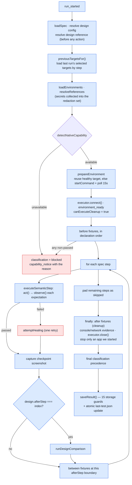

# 05 — Execution, healing, design and safety

`src/execution.js` (852 lines) is the engine both pipelines converge on. This
document walks `executeRun()` end to end, then the healing machine, the design
comparator, and the safety guards.

---

## 1. `executeRun()` — the full lifecycle



### Final classification precedence
```js
if      (passed && design.status === "regression")  → design_regression
else if (passed && design.status === "not_checked") → blocked   // declared but not completed
else if (passed && healedSteps > 0)                 → healed
// otherwise the first failure already set functional_regression / blocked
```
A cleanup failure is appended to the explanation
(`"…. Cleanup issue: cleanup-test-order failed"`) but **never replaces** the
primary classification.

---

## 2. Semantic step execution

`executeSemanticStep(executor, item, context)`:
1. `await executor.act(intent, context)` — an exception becomes `blocked` if
   `error.code === "NATIVE_BLOCKED"`, else `failed`; the message becomes the
   observation on every expectation.
2. If the action reports `blocked`/`failed`, every expectation inherits that status
   and a `failure: { stage: "action", … , previousTarget }` is recorded.
3. Otherwise merge `action.outputs` into the run's shared `outputs` object —
   through `mergeOutputs()`, which blocks `__proto__` / `constructor` / `prototype`
   keys (prototype-pollution guard on data coming from a sub-agent).
4. `observeExpectations()` — each expectation goes through
   `normalizeObservation`, which accepts a boolean or
   `{ status, observation }` and **throws `INVALID_NATIVE_RESPONSE` on anything
   outside `passed|failed|blocked`**. A sub-agent cannot invent a status.
5. Step status = blocked > failed > passed (worst wins).

### The context handed to the executor
`{ runId, scope: "fixture"|"test", phase, stepIndex, fixtureId?, fixtureStepIndex?,
channel, inputs, outputs, target, signal, previousTarget }`.

`channel` comes from `channelFor(step)` and defaults to `"web"`; the five channels
are `web | chat | voice | workflow | api`. The channel is part of the contract:
`RESULT_CHANNEL_CHANGED` rejects a result whose step channel differs from the spec.

---

## 3. Fixtures

Fixtures are **reusable semantic workflows**, executed through the *same*
`executeSemanticStep` as tests — not scripts, not Playwright code.

| Phase | When | On failure |
| --- | --- | --- |
| `before` | in declaration order, before step 1 | status `blocked` → run `blocked`; status **`failed`** → run **`functional_regression`** |
| `between` | after the passing step whose index equals `afterStep` | same split as `before` |
| `after` | in a **finally** path whenever the native session was usable | recorded separately; never overwrites the primary classification |

> **Fixed in PR #3 (corner case H4).** `executeRun` used to collapse *any*
> non-`passed` `before`/`between` fixture into `blocked`, so a fixture whose steps
> ran fine but whose **postcondition assertion genuinely failed** was reported as
> environment noise rather than a defect. It now splits the two:
> ```js
> primaryClassification = status === "blocked" ? "blocked" : "functional_regression";
> ```
> with the code comment: *"a failed fixture postcondition is a real product signal,
> not environment noise. Only blocked stays blocked; failed is a functional
> regression and is never healed."*

Each fixture:
- resolves its `inputs` through `resolveReferences` (`${QA_CUSTOMER_PASSWORD}`,
  `${outputs.order.id}`), adding every resolved value to the redaction set —
  a missing variable is a **blocked** fixture, not a crash;
- runs its steps;
- **verifies its own top-level postcondition** (`observeFixturePostconditions`);
- captures a checkpoint or failure screenshot;
- emits `fixture_started` / `fixture_completed` journal events.

`between.afterStep` must be **strictly less than** the step count
(`INVALID_FIXTURE_POSITION`) — a between-fixture after the last step is an `after`
fixture, and saying so at validation time prevents a meaningless spec.

Fixtures themselves are still **never healed** — `attemptHealing` is wired only into
test steps, so a failed fixture postcondition goes straight to
`functional_regression` with no recovery attempt.

---

## 4. Healing — `attemptHealing()` + `src/healing.js`

### Entry conditions
Only when `failed.status === "failed"` **and** a `failure` exists. `blocked` never
heals. Then:
- action-stage failure + `executor.supports("rediscover")` → `target_rediscovery`
- expectation-stage failure + `executor.supports("waitFor")` → `readiness_wait`
- neither → return the failure untouched

### Strategy A — `target_rediscovery`
1. `capture("healing-before-step-N")`.
2. `executor.rediscover(intent, { ...context, failure, currentObservation,
   previousTarget, expectations: guard.expectations })` — the sub-agent gets the
   unchanged intent, the current observation, **the target that used to work**, and
   the original expectations.
3. `normalizeRediscovery()` — accepts only `status: "found"` **and**
   `equivalent === true` **and** a target. Anything else becomes `ambiguous` with an
   explanation.
4. `classifyFailure()` → must be `retry_equivalent_target`, else record a
   failed/blocked verification.
5. `executor.recover(intent, target, { ...ctx, healing: true, originalFailure,
   previousTarget })` — one attempt.
6. `guard.assertUnchanged()`, then **re-observe the original expectations**.
7. `capture("healing-after-step-N")`.

### Strategy B — `readiness_wait`
For each expectation that did not already pass, `executor.waitFor(expectation, ctx)`.
A blocked wait, or a throw, blocks the heal. Then `guard.assertUnchanged()` and
re-observe. **Never a fixed sleep** — that is a scope boundary, not an
implementation detail.

### The evidence rule
```js
if (decision.classification === "healed" && (!beforeScreenshot || !afterScreenshot)) {
  decision = { decision: "blocked", classification: "blocked",
    reason: "Recovery passed but required before/after screenshot evidence is unavailable" };
}
```
A heal you cannot see is not a heal.

### The healing record persisted on the step
```json
{ "strategy": "target_rediscovery",
  "outcome": "healed",
  "originalFailure": "The previously used Proceed to checkout control is absent. Previous target: Proceed to checkout link",
  "replacement": "Continue to payment",
  "verification": "The original expectations passed unchanged after recovery",
  "beforeScreenshot": "screenshots/007-healing-before-step-2.png",
  "afterScreenshot":  "screenshots/009-healing-after-step-2.png" }
```

### The four unbreakable healing rails

| # | Rail | Mechanism |
| --- | --- | --- |
| 1 | Expectations are immutable | `createExpectationGuard` — `JSON.stringify` baseline + frozen copy, asserted 3× per heal, throws `EXPECTATION_MUTATED` |
| 2 | Equivalence must be explicit | `normalizeRediscovery` requires `equivalent === true`; *"The replacement was not explicitly confirmed as equivalent"* |
| 3 | Exactly one retry | `attemptHealing` has no loop |
| 4 | Evidence or downgrade | before **and** after screenshot required, enforced again at `saveResult` |

Plus a fifth at the report layer: a healed run whose later step fails ends
`functional_regression` — a later functional failure always overrides earlier healing.

---

## 5. Design comparison — `runDesignComparison()` + `src/design.js`

### Trigger
Only after the step whose index equals `design.afterStep` **passes**. The default
`afterStep` is the last step; the default viewport is **1440×1000**.

### Reference resolution (before any action runs)
Resolved *up front* so an unresolvable reference blocks the run instead of wasting a
browser session:

| Reference form | Result |
| --- | --- |
| `${SECRET}` indirection | resolved and marked sensitive |
| `https://…figma.com/…` | `kind: "figma"` |
| any other `http(s)` URL | `kind: "url"` |
| repo-relative or absolute path to `.png/.jpg/.jpeg/.webp` | `kind: "image"` + the bytes |
| path escaping the repository (after `realpath` on both ends) | `DESIGN_REFERENCE_OUTSIDE_REPOSITORY` |
| `file://host/...` | rejected on **every** platform (UNC/SMB reach-out on Windows) |
| missing/unreadable | `DESIGN_REFERENCE_NOT_FOUND` |
| non-image extension | `UNSUPPORTED_DESIGN_REFERENCE` |

### The comparison request
```json
{ "version": 1,
  "reference": { "kind": "image", "source": "…/approved-confirmation.png", "image": {…} },
  "actual":    { "path": "screenshots/012-design-actual-step-3.png", "image": {…} },
  "viewport":  { "width": 1280, "height": 900 },
  "checkpoint":{ "afterStep": 3 },
  "rules":     [ …the six DESIGN_COMPARISON_RULES… ] }
```

### Admission of the answer (`normalizeDesignComparison`)
- status ∈ `matched | regression | blocked`, else **blocked**;
- every finding must have a valid `category`, a valid `status`, and a **non-empty**
  explanation, else the whole comparison is **blocked** ("returned an invalid finding");
- `regression` with no regression finding → **blocked**;
- `matched` with a regression finding → **blocked** ("contradicted its own matched decision");
- `not_checked` design status on an otherwise passing run → the **run** is `blocked`.

### Why this is the strictest seat
> *Agent taste cannot create a release-blocking design regression.* The reference
> must exist, resolve, and be evidenced; the actual screenshot must be captured and
> present in `evidence.screenshots`; and the findings must be concrete and
> internally consistent. Otherwise the answer is "blocked", not "regression".

Design baselines are **never** updated automatically.

---

## 6. Evidence capture

- `captureArtifact(label, details, screenshotContext)` calls
  `executor.screenshot({ runId, checkpoint, avoidSensitiveFields: true, outputs, … })`.
  **`avoidSensitiveFields: true` is always passed** — the executor is told not to
  photograph populated credential fields.
- `screenshotArtifact()` accepts a Buffer/Uint8Array, `{ data, extension, encoding:
  "base64" }`, or `{ path }` (read from disk). Extension must be
  `png|jpg|jpeg|webp`, else `INVALID_SCREENSHOT`.
- Filenames are `NNN-<slugified-label>.<ext>`, sequence-numbered from the journal
  length, and written through `saveScreenshot` → `atomicWriteFile`. The result stores
  the **run-relative** path `screenshots/…`.
- A screenshot failure is **not** a run failure: it becomes a `capability_notice`
  event and a de-duplicated entry in `evidence.unsupported[]`.
- Console and network errors are collected in the `finally` block, redacted, and
  stored; if the driver does not expose them, `unsupported` says so explicitly.

Evidence is captured after every fixture, after every step (checkpoint or failure),
before and after every heal, and at every design checkpoint.

---

## 7. The event journal

Every run carries an in-result event list, schema-constrained to 15 types:

```
run_started · environment_ready · capability_notice
fixture_started · fixture_completed
step_started · step_completed
healing_started · healing_completed
design_started · design_completed
screenshot_captured
cleanup_started · cleanup_completed
run_completed
```

Each event: `{ sequence, at, type, status?, phase?, fixtureId?, stepIndex?, message? }`,
redacted at construction time (`EventJournal.add` applies `redact` before pushing).

This is separate from `trace.jsonl` — the journal lives **inside `result.json`** and
describes one run; the trace describes one orchestration.

---

## 8. Safety guards, consolidated

| Threat | Guard |
| --- | --- |
| Secret leaking into YAML / result / trace / terminal / screenshot | `${VAR}` references only; `resolveReferences` collects; `redactSensitive` scrubs recursively; screenshots requested with `avoidSensitiveFields` |
| Redaction corrupting the contract | `IMMUTABLE_CONTRACT_FIELDS` are never rewritten |
| Prototype pollution from sub-agent data | `mergeOutputs` and `outputValue` block `__proto__`/`constructor`/`prototype` |
| Path traversal via IDs | `assertStableId` + strict `runId` / screenshot-name regexes |
| Escaping the repo with a design reference | `realpath` both ends + `isInside` check |
| SMB reach-out via `file://host/...` | rejected on all platforms |
| Orphaned dev servers holding ports | `stopProcessTree` (`taskkill /T /F` on Windows, process group on POSIX) |
| Half-written state after a crash | `atomicWriteFile` (temp + fsync + rename) |
| Billion-laughs YAML | `maxAliasCount: 100` |
| Oversized UI request bodies | 1 MB cap → `REQUEST_TOO_LARGE` |
| Remote target by accident | loopback-only unless `--allow-remote` |
| UI exposed off-host | `assertUiAddress` loopback whitelist + strict CSP |
| Screenshot enumeration through the UI | only paths present in that run's `evidence.screenshots` are served |
| A run claiming something it cannot support | 15 `saveResult` guards (see [06](06-storage-schemas-evidence.md)) |
| Cancellation leaving the app running | `signal` checked between steps; `finally` still runs cleanup and stops what it started |

---

## 9. `qa-agent audit <run-id>` — the governance checklist

An independent verifier that re-reads the spec and result from disk and prints
PASS/FAIL per check:

1. classification is one of the five known values;
2. **expectations byte-for-byte unchanged** vs the spec;
3. channels unchanged;
4. healing has before/after evidence;
5. a `healed` classification has a real recovery and no failed steps;
6. a declared design check actually completed;
7. a design regression has concrete findings and an actual screenshot;
8. no undeclared design result;
9. every declared screenshot is present in `evidence.screenshots`;
10. no resolved secret placeholder leaked into the serialized result.

Exit code 0 when all pass, 1 otherwise. This is the "governed AI" artifact for an
enterprise reviewer — the system checking its own homework with a different code
path from the one that wrote it.
