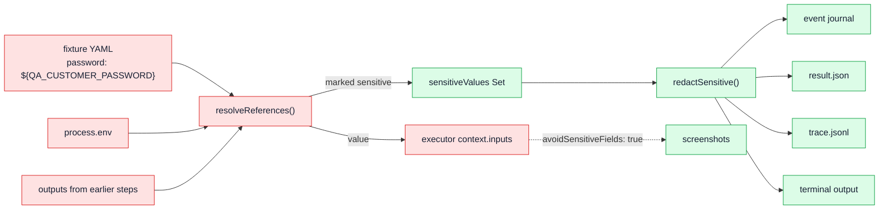

# 06 — Storage, schemas and evidence

> Historical storage deep dive. The optimized runtime also writes exact-history
> `request.json` manifests and selects `.qa/last-test.json` once after concurrent
> workers join; see [Current orchestration structure](../current-orchestration-structure.md).

The system has no database. Every piece of state is a validated file in the
developer's own repository. This document is the contract reference.

---

## 1. The `.qa/` workspace layout

```
<application repo>/
└── .qa/
    ├── environments.yaml            # named targets (web/desktop), secrets as ${VAR}
    ├── fixtures/
    │   ├── login-customer.yaml      # reusable setup workflow + postcondition
    │   └── cleanup-test-order.yaml
    ├── specs/
    │   ├── checkout-card.yaml       # selector-free semantic tests
    │   └── …
    ├── last-test.json               # { specId, environment, lastRunId? }
    └── runs/
        ├── run_20260905_101532_a1b2/
        │   ├── result.json          # the full verdict + events + evidence
        │   └── screenshots/
        │       ├── 001-checkpoint-before-login-customer.png
        │       └── …
        └── orchestrations/
            └── orch_1757068800000/
                ├── site-map.json  test-plan.json  test-plan.md
                ├── gaps.json      gaps.md
                ├── report.json    report.md      report.yaml
                ├── trace.jsonl
                └── generated/
                    ├── _resolve.js  _auth.js
                    ├── <spec>.spec.js
                    └── <spec>.locators.json
```

Every one of these is an **ordinary reviewable project file** — diffable, committable,
and readable without the tool that wrote it.

---

## 2. The ten contracts

| Kind | File | Governs |
| --- | --- | --- |
| `environments` | `environments.schema.json` | Named web/desktop targets |
| `fixture` | `fixture.schema.json` | Reusable setup/cleanup workflows |
| `spec` | `spec.schema.json` | The semantic test — **the product's core contract** |
| `result` | `result.schema.json` | One executed run |
| `lastTest` | `last-test.schema.json` | The selection pointer |
| `siteMap` | `site-map.schema.json` | The crawl output |
| `planDraft` | `plan-draft.schema.json` | **What the Planner sub-agent must return** |
| `testPlan` | `test-plan.schema.json` | The normalized plan the gate evaluates |
| `gaps` | `gaps.schema.json` | The coverage-gate result |
| `report` | `report.schema.json` | The judge-facing artifact |

All are JSON Schema draft-07, all `additionalProperties: false` (except two
deliberate spots), all compiled once at load with `strict: true`.

### 2.1 `spec.schema.json` — the semantic test
```yaml
version: 1
id: checkout-card                 # ^[a-z][a-z0-9]*(?:-[a-z0-9]+)*$
title: Customer completes checkout
environment: local
fixtures:
  before: [login-customer]
  between: [{ afterStep: 2, fixtures: [seed-promo] }]
  after: [cleanup-test-order]
design:                           # optional
  reference: ./design/approved-confirmation.png
  viewport: { width: 1280, height: 900 }   # 320–7680 each
  afterStep: 3
steps:                            # minItems 1
  - intent: Open the shopping cart
    channel: web                  # optional: web|chat|voice|workflow|api
    expect:                       # minItems 1, non-empty strings
      - Cart contains one item
```
**There is no field in this schema for a selector, an XPath, a coordinate, a delay,
or a script.** The absence is the design.

### 2.2 `fixture.schema.json`
`inputs` keys are camelCase-constrained (`^[a-z][A-Za-z0-9]*$`) and values **must**
match `^\$\{(?:[A-Z][A-Z0-9_]*|outputs\.[A-Za-z][A-Za-z0-9_.-]*)\}$` — the schema
itself makes a literal secret unrepresentable. Top-level `expect` (the
postcondition) is required with `minItems: 1`. `idempotent: true` marks cleanup
fixtures safe to re-run.

### 2.3 `result.schema.json`
`runId` must match `^run_[0-9]{8}_[0-9]{6}(?:_[a-z0-9]+)?$`; timestamps must be
ISO-Z; screenshot paths must match
`^screenshots/[a-z0-9][a-z0-9-]*\.(?:png|jpe?g|webp)$` (so a result cannot reference
anything outside its own run directory); `classification` is the closed 5-value
enum; healing requires `strategy`, `outcome`, `originalFailure`, `replacement`,
`verification`; design results require `reference`, `referenceKind`, `viewport`,
`afterStep`, `status`, `explanation`; the event `type` enum is closed at 15 values.

### 2.4 `plan-draft.schema.json` — the sub-agent's wire contract
The most interesting schema, because it is what constrains a model:

```jsonc
{ "flows": [ {                     // minItems 1
    "id": "checkout_happy_path",
    "title": "…", "category": "happy|error|edge",
    "priority": "critical|high|medium|low",
    "rationale": "Why this flow is worth testing on THIS application.",
    "pages": ["/cart", "/checkout"],
    "preconditions": ["authenticated"],
    "risks": ["double submission"],
    "requirementIds": ["REQ-3"],
    "steps": [ {                   // minItems 1
      "intent": "…",               // required
      "page": "/checkout",
      "action": "navigate|click|fill|submit|observe",
      "channel": "web|chat|voice|workflow|api",
      "inputs": [{ "name": "card", "value": "4242…", "sensitive": false }],
      "expect": [ {                // optional on a pure action step
        "prose": "Order confirmation is visible",
        "assert": { "kind": "text|absent_text|url_contains|visible|absent|count",
                    "value": "Thank you for your order",
                    "selector": "…", "count": 0 }
      } ]
    } ] } ],
  "openQuestions": ["…what could not be determined…"],
  "notes": "How the plan was scoped." }
```

The `predicate` definition carries its own instruction in the schema description:
> *"Never copy the prose into value. The value must be text observed in the crawl,
> not a description of it."*

`inputs` is a **list, not a map**, specifically so the wire schema stays
OpenAI-strict-mode compatible.

### 2.5 `test-plan.schema.json`
Accepts **both** expectation shapes — a bare string (deterministic planner) and
`{ prose, assert }` (sub-agent) — via `oneOf`. Adds `source` (`planner`,
`attempts`, `fellBack`, `fallbackReason`), `guidance` (prompt + PRD), `siteMapRef`,
`coverageClaims`, `openQuestions`. `step.expect` may be empty *only* for an
action-only step, and the schema says so in its own description, pointing at
`mergeActionSteps()` and the gate's `assertion-presence` rule.

### 2.6 `report.schema.json`
Closed-shape everything: verdict enum, scenario-status enum, confidence bounded
0–1, coverage score bounded 0–1, PRD requirement status enum. `gaps` and
`untestedRisks` are the two deliberately loose arrays (they carry rule-specific
payloads).

---

## 3. `QaWorkspace` — the 30+ guards

### Path guards
| Method | Guard |
| --- | --- |
| `specPath(id)` / `fixturePath(id)` | `assertStableId` → `INVALID_ID` |
| `resultPath(runId)` | strict `run_YYYYMMDD_HHMMSS[_suffix]` regex → `INVALID_RUN_ID` |
| `screenshotPath(runId, name)` | validates the runId **and** `^[a-z0-9][a-z0-9-]*\.(png\|jpe?g\|webp)$` → `INVALID_SCREENSHOT_NAME` |

### Referential integrity
| Operation | Refuses when |
| --- | --- |
| `saveEnvironments` | any existing spec references an environment being removed → `ENVIRONMENT_IN_USE` |
| `saveSpec` / `validateSpec` | unknown environment → `UNKNOWN_ENVIRONMENT`; unknown fixtures → `UNKNOWN_FIXTURE` (all listed); `between.afterStep >= steps.length` → `INVALID_FIXTURE_POSITION`; `design.afterStep > steps.length` → `INVALID_DESIGN_POSITION` |
| `loadSpec` / `loadFixture` | filename ≠ document id → `ID_MISMATCH` |
| `deleteFixture` | any spec still references it → `FIXTURE_IN_USE` |
| `deleteSpec` | it is the currently selected spec → `SPEC_SELECTED` |
| `readLastTest` | pointer's run belongs to another spec/environment → `RUN_MISMATCH` |

### `saveResult()` — 15 guards, the heart of "cannot lie"
1. environment must exist;
2. `completedAt >= startedAt` → `INVALID_RUN_TIME`;
3. no duplicate step index → `DUPLICATE_RESULT_STEP`;
4. no step index beyond the spec → `UNKNOWN_RESULT_STEP`;
5. **step intent must match the spec exactly** → `RESULT_INTENT_CHANGED`;
6. **step channel must match** → `RESULT_CHANNEL_CHANGED`;
7. **expectations and their order must match byte-for-byte** → `RESULT_EXPECTATION_CHANGED`;
8. every recorded fixture must be declared in the spec's plan for that phase → `UNKNOWN_RESULT_FIXTURE`;
9. every referenced screenshot must exist on disk → `MISSING_SCREENSHOT`;
10. design result present ⟺ spec declares design → `UNEXPECTED_DESIGN_RESULT` / `MISSING_DESIGN_RESULT`;
11. design reference, viewport and `afterStep` must match the spec → `DESIGN_REFERENCE_CHANGED` / `DESIGN_CHECKPOINT_CHANGED`;
12. a completed comparison needs a resolved reference and an actual screenshot in evidence → `UNRESOLVED_DESIGN_REFERENCE` / `MISSING_DESIGN_EVIDENCE`;
13. a design regression needs a regression-status finding → `UNSUPPORTED_DESIGN_REGRESSION`;
14. every healed step must be `passed` and carry **both** screenshots → `HEALING_STATUS_MISMATCH` / `MISSING_HEALING_EVIDENCE`;
15. classification consistency:
    - `healed` requires a real healed step (`HEALED_WITHOUT_RECOVERY`) and no failed step (`HEALED_WITH_FAILED_STEP`);
    - `passed` with a successful heal → `HEALING_CLASSIFICATION_MISMATCH`;
    - `design_regression` requires a declared reference + regression status (`DESIGN_REGRESSION_WITHOUT_REFERENCE`) and no failed step (`DESIGN_REGRESSION_WITH_FAILED_STEP`);
    - `passed`/`healed` hiding a design regression → `DESIGN_CLASSIFICATION_MISMATCH`;
    - `passed`/`healed` with an unfinished design check → `DESIGN_NOT_CHECKED`.

Only after all 15 does it write `result.json` atomically, update `last-test.json`
atomically, and prune.

> **Slide line:** *the storage layer is a second, independent verifier.* Even if the
> execution engine were compromised, a fabricated result cannot be persisted.

### Retention (`pruneResults`)
`MAX_RECENT_RUNS_PER_SPEC = 20`. Results sort newest-first by `completedAt` then
`runId`; anything past 20 has its whole run directory removed. The just-written run
is always preserved even if the sort would drop it.

### Deletion (`deleteResult`)
Removes exactly one run directory, and if that run was the `lastRunId`, **repairs
the pointer** to the most recent remaining result for the same spec+environment (or
drops `lastRunId` entirely).

---

## 4. Secrets: the full path



Rules:
- Only a **whole-string** `${…}` resolves — a secret cannot be interpolated into prose.
- Every resolved value is added to the redaction set, longest-first replacement.
- Redaction skips `Buffer`s (image bytes) and never rewrites contract fields.
- The orchestration tracer is seeded with the username and password **at
  construction**, so line 1 of `trace.jsonl` is already safe.
- `qa-agent audit` independently greps the serialized result for placeholder leakage.

---

## 5. The generated sidecar (`<spec>.locators.json`)

Not schema-validated (deliberately — it is a generation-internal artifact, not a
graded one), but structurally stable:

```jsonc
{ "specId": "flow-checkout-form-0-happy",
  "origin": "http://127.0.0.1:4555",
  "preconditions": ["authenticated"],
  "validated": true,
  "validatedAt": "2026-09-05T10:15:32.000Z",
  "probeSource": "fetch",            // planner | fetch | executor
  "bindings": [ {
    "stepIndex": 1, "targetRef": "form:0", "page": "/checkout", "action": "submit",
    "candidates": [ { "strategy": "role", "value": ["button", {"name":"Place order"}], "confidence": 0.9 }, … ],
    "inputs": [ { "name": "card", "value": "4242…", "candidates": [ … ] } ],
    "expectations": [ { "prose": "Order confirmation is visible",
                        "predicate": { "kind": "text", "value": "Order QA-1001" },
                        "validated": true } ],
    "resolvedStrategy": "role",
    "assertionValidated": true } ],
  "stats": { "locatorsResolved": 1, "locatorsProbed": 1, "locators": 1,
             "assertionsChecked": 2, "assertionsVerified": 2, "assertionsRefuted": 0,
             "withPredicates": 2, "totalExpectations": 2 } }
```

**The separation is the point:** semantic YAML is the canonical *contract* (human,
stable, selector-free); generated JavaScript and sidecars are disposable,
rewritable state (mechanical and regenerable). Fetch preflight can reject obvious
misses, browser replay proves behavior, and source hashes reject edits. Healing
rewrites state, never contract.

`trace.jsonl` is likewise unvalidated by design — it is an append-only event log, and
schema-validating one line at a time would add cost without catching the failure mode
that matters (a structurally broken document).

---

## 6. What a reviewer can verify without running anything

| Question | File to open |
| --- | --- |
| What was tested, in human terms? | `.qa/specs/*.yaml` |
| Did the agent change an expectation to make it pass? | `result.json` step `expectations[].expectation` vs the spec — and `qa-agent audit` proves it |
| What did the agent see? | `result.json` `expectations[].observation` + `screenshots/` |
| Why did it decide that? | `result.json` `events[]`, `trace.jsonl`, `report.md` "What the agent decided" |
| What did it choose not to test, and why? | `gaps.json` `untestedRisks[]`, `test-plan.json` `openQuestions[]`, `report.md` PRD gap section |
| Was a model involved, and did it fall back? | `plan.source` / `report.planSource` |
| Are the generated tests real? | `generated/*.spec.js` + `*.locators.json` `validated` + `stats` |
