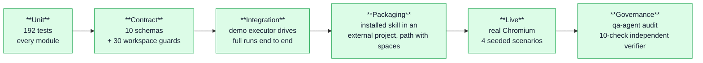

# 08 — Testing, verification and the demo apparatus

> Historical test snapshot. Current verified counts and complete raw timing
> samples are in [Optimized agent orchestration](../optimized-agent-orchestration.md)
> and [`docs/benchmarks/`](../benchmarks/).

How a QA tool proves its own QA.

---

## 1. Measured status

Reproduced 2026-09-05 at `d8199ad` (post PR #3 merge):

```
$ node --test
ℹ tests 192   ℹ pass 191   ℹ fail 0   ℹ skipped 1   ℹ duration_ms 6590
```
(The one skip — `initialization propagates unexpected access failures` — needs
symlink privileges to create the `ELOOP` condition it tests.)

```
$ node --test --experimental-test-coverage --test-coverage-include='src/**/*.js'
all files | 96.64 % lines | 82.77 % branches | 95.56 % functions
```

Per-file coverage, worst branch coverage first:

| File | Lines | Branches | Functions |
| --- | --- | --- | --- |
| `reporter.js` | 97.20 | **52.81** | 85.71 |
| `planner-agent.js` | 97.37 | **57.61** | 95.24 |
| `orchestrator.js` | 86.88 | **61.80** | 92.86 |
| `generator.js` | 98.08 | **64.66** | 100 |
| `planner.js` | 96.04 | 74.29 | 94.74 |
| `playwright-executor.js` | 93.69 | 74.00 | 90.70 |
| `coverage.js` | 95.90 | 76.92 | 97.96 |
| `locator-chain.js` | 90.16 | 79.55 | 100 |
| `environment.js` | 94.69 | 81.82 | 85.71 |
| `cli.js` | 86.09 | 87.18 | 77.42 |
| `ui-server.js` | 98.52 | 91.21 | 95.56 |
| `execution.js` | **100** | 96.33 | **100** |
| `healing.js` · `errors.js` · `index.js` · `samples.js` | **100** | **100** | **100** |
| `storage.js` | 99.70 | 98.81 | 98.53 |
| `design.js` · `references.js` · `schema-validator.js` · `documents.js` · `draft.js` · `native-executor.js` · `trace.js` | 100 | 88–99 | 89–100 |

PR #3 added 9 tests (183 → 192) and moved `playwright-executor.js` from 68 % to
74 % branch coverage; overall branch coverage dipped 0.3 pt because the new
planner journey/predicate code added branches faster than tests covered them.

> `package.json` declares gates of 100 / 95 / 98. **They are not currently met**
> (branch coverage is the shortfall). `npm test` is green; `npm run test:coverage`
> is not. Say that plainly — `exp_1.md` and `TODO.md` both record the deliberate
> call: *"functionality first, coverage sweep explicitly cut before the final."*

---

## 2. The 35 test files, by concern

| Concern | Files | Tests |
| --- | --- | --- |
| **Contracts & workspace** | `workspace`, `workspace-boundaries`, `documents`, `draft`, `core-boundaries` | 38 |
| **Execution engine** | `execution`, `execution-boundaries` | 17 |
| **Healing** | `healing` | 16 |
| **Design** | `design`, `phase-04-coverage` | 13 |
| **Planner & crawl** | `planner-crawl`, `planner-parse`, `planner-plan`, `planner-hardening`, `planner-agent` | 27 |
| **Coverage gate** | `coverage`, `coverage-hardening` | 14 |
| **Generator** | `generator-hardening` | 7 |
| **Orchestration & triage** | `orchestrate` | 7 |
| **Trace** | `trace`, `trace-hardening` | 6 |
| **UI** | `ui-server`, `ui-orchestrations`, `ui-trace` | 9 |
| **CLI** | `cli`, `cli-coverage`, `cli-audit` | 13 |
| **Sub-agent corner cases** | `subagents-corner` | 11 |
| **Deterministic replay** | `replay`, `replay-browser` | 12 |
| **Packaging** | `skill-package` | 1 |
| **Demo app, corner drill & reference driver** | `demo-reset`, `demo-corner-scenarios`, `corner-demo`, `playwright-executor` | 16 |

### Test names that double as specification
The suite reads like a requirements document. A sample:
- *"an expectation with no predicate never becomes a self-asserting test"*
- *"assertion validation refutes text and paths the application does not have"*
- *"an unreachable target is never reported as validated"*
- *"a genuine broken outcome remains a functional regression after an earlier healed action"*
- *"recovery cannot hide an expectation that still fails"*
- *"ambiguous replacements are recorded but never acted on"*
- *"workspace refuses fabricated healed classifications and evidence"*
- *"result persistence rejects every form of semantic contract drift"*
- *"a plan whose expectations cannot be evaluated is not a passing plan"*
- *"coverage misses confined to pages the developer scoped out do not block"*
- *"prompt matching is generic, not a hardcoded topic table"*
- *"category-mix reports skew without blocking a consolidated plan"*
- *"decideVerdict oscillation guard escalates non-improving replans"*
- *"planner lifecycle is traced so the sub-agent is legible in the artifact"*
- *"P5 corner: planner cannot smuggle selectors or invented predicates"*
- *"installed skill owns setup, native execution, evidence, and UI from an external project"*

Added by PR #3:
- *"H4: failed fixture postconditions are functional regressions, never blocked or healed"*
- *"planner attaches predicates from crawled text, never invented copy"*
- *"observations match single blocks and open intents no-op when shown"*
- *"test-scope acts do not navigate away from fixture state"*
- *"bare sign-in no-ops when authed but negative variants still submit"*
- *"between-fixture fills survive clearing until navigation"*
- *"clicks prefer testid and leave a chain receipt on fallback"*
- *"partial keyword overlap navigates and leaves a fuzzy receipt"*

---

## 3. Test infrastructure

**`test-support/fake-fetch.js`** — a route-table fetch double returning
`{status, ok, headers.get(), text(), json()}`, with `set-cookie` and `location`
support and a call log. Lets the crawl, auth, and selector-validation paths be
tested against realistic HTML without a server. Ships canned `LOGIN_HTML`,
`HOME_HTML`, `CART_HTML`, etc.

**`test-support/fixtures/`** — recorded `demo-site-map.json` and
`demo-test-plan.json`, so generator tests read fixtures instead of re-crawling.
(This is also why the crawl's redirect-path bug is *shelved* rather than fixed —
changing the crawl means re-recording these.)

**`test-support/demo-native-executor.js`** — a deterministic `NativeExecutor`
implementing the whole contract against the demo app over HTTP: intent-keyed `act`,
containment-based `observe`, a 1×1 PNG for `screenshot`, plus `rediscover`/`recover`
so healing paths are exercised end to end without a browser.

**`test-support/helpers.js`** — temp workspaces, a platform-appropriate no-op
`$EDITOR` (`.cmd` on Windows, `.sh` elsewhere), and a `canSymlink()` guard.

---

## 4. The corner-case matrix (`docs/corner-test-cases.md`)

A 28-case matrix scoped specifically to the **judgement sub-agents**. The fast
boundary cases live in `test/subagents-corner.test.js`; integration evidence for
H4/H7/D1/D4/E4/E5 stays in the execution, healing, design, and live-demo suites.
`npm run demo:corners` reads the matrix from the document and runs the exact
mapped evidence for every ID.

### P — Planner sub-agent (10 cases)
| ID | Corner | Expected |
| --- | --- | --- |
| P1 | No capability | deterministic fallback, reason recorded, run continues |
| P2 | Capability throws | fallback + `planner_failed` traced, no stall |
| P3 | Invalid draft ×2 | 2nd attempt gets the rejection as `feedback`, then fall back |
| P4 | Empty flows | rejected — never generate from an empty plan |
| P5 | Prose copied into `assert` | rejected by instruction, or refuted at `validateSelectors`; honest path is omit → `UNVERIFIED` |
| P6 | Anonymous crawl + `authenticated` flow | brief says `CRAWL SESSION: anonymous`; plan signs in or records doubt |
| P7 | Degraded SPA shell | brief warns; plan must not claim full coverage |
| P8 | Truncated site map | brief ends `site map truncated`; planner says so |
| P9 | ID collision | `normalizePlan` dedupes; both flows addressable |
| P10 | Lifecycle legibility | `planner_started` + completed/rejected/failed in `trace.jsonl` |

### H — Healing (8 cases)
Rename with behaviour intact → one retry → `healed` **only** with unchanged
expectations + evidence · button removed → `functional_regression` · copy changed →
never heal · **H4 fixture postcondition failure → `functional_regression`, never
healed (fixed in PR #3)** · no capability → no retry · blocked/ambiguous → never a
pass · later failure overrides an earlier heal · expectation-stage failure without
`waitFor` stays failed.

### D — Design (4 cases)
No explicit reference → `not_checked` · missing evidence → `blocked` · invalid
comparator output → `blocked` · reference-backed diffs → `design_regression` with
structured findings and an untouched functional verdict.

### E — Executor / safety (6 cases)
Kind mismatch · missing methods (named) · no executor → `blocked`, never claim UI
drive · secret leak → never anywhere · `after` cleanup failure → finally path still
runs, primary classification preserved · remote target without `--allow-remote` →
`ORCHESTRATION_REMOTE_BLOCKED`.

### Demo linkage

- **H4 is implemented and live-seedable.** PR #3 split fixture `failed` from
  `blocked` in `execution.js`; `npm run demo:reset -- fixture` now exposes the
  same boundary through the demo app.
- D1, H1, H2, H3, H4, H7, D4, and E5 have deterministic app states. P7 has the
  client-rendered `/spa-shell` target. The remaining cases are runtime contracts,
  so the demo runner presents their focused executable evidence instead of a
  fabricated UI mutation.

---

## 5. Verification levels



Level 6 is the one most projects lack: an **independent re-verification path**. The
audit command re-reads the spec and the result from disk and checks the claims
against each other, using different code from the code that produced them.

---

## 6. Live verification evidence (recorded, not claimed)

| Run | Result |
| --- | --- |
| Cold `orchestrate --plan-only` on demo-app, **current tree `d8199ad`** | gate **escalate at 0.7**, 7 flows, **4 multi-step journeys**, 15/21 predicates, PRD gap 0.8 with exactly REQ-4 uncovered, 1 declared open question (full table in [04](04-orchestration-pipeline.md)) |
| Cold `orchestrate` on demo-app, **pre-PR-#3** | gate pass at 0.95, 11 flows (5H/4E/2e), 0 multi-step, 0 predicates, 10/10 selectors validated, 30 trace events |
| Real Chromium (`run-with-playwright.mjs`) | browser opens; **5/11 scenarios genuinely pass**; the pipeline completes with red verdict `defects_found` (exit 10), not a crash |
| Shell mode, no executor | every scenario `blocked` **with reasons**; exit 11 — by design |
| Agent-driven Chromium, 4 scenarios | `passed` / `healed` / `functional_regression` / `design_regression`, each for the right reason (table in [07 §5](07-ui-cli-surface.md)) |
| Adversarial inputs | dead port → 20; remote without flag → hard stop; bad PRD → clear error |
| Windows | 191/192, 0 fail (was 161/162 when the four Windows bugs were fixed) |

**Two bugs live verification found that unit tests did not.** Both are worth telling,
because they are the argument for running the thing against a real browser:

1. `playwright-executor.js`'s "single visible submit button" fallback fired on the
   fixture's *"Open the login page"* step — a pure observation step — and clicked
   "Sign in" with empty fields one step early. Fixed by excluding
   `open|view|go to`-shaped intents from that fallback.
2. Bag-of-words observation passed *"Customer dashboard is visible"* **on the login
   page**, by taking "customer" from a heading and "dashboard" from the nav —
   **proven by screenshot on a pass-variant run**. Fixed in PR #3 by scoring
   observations against a *single semantic block* (title / heading / paragraph /
   list item / button / link / label / cell) at a ≥ 60 % hit rate instead of the
   whole page at ≥ 50 %.

The second one is the more instructive: a false **pass** is the most dangerous
failure a QA tool can have, and only a live run surfaced it.

---

## 7. The self-verification gaps worth naming

`TODO.md` §3 is an unusually honest list of tests that *should* exist:

| # | Missing test | Why it matters |
| --- | --- | --- |
| 3.1 | **Seeded-defect confusion matrix** — mutate the app in 8 known ways, assert precision/recall per classification | The only test that can catch a healer that heals *too eagerly*; also the number to put on a slide |
| 3.2 | **Generated tests must actually execute** — run every emitted `.spec.js` under Playwright against a known-good app and require a pass | Bugs 0.1/0.2 (self-asserting prose, skipped auth) would have failed this on the first run |
| 3.3 | **Target-shape conformance** — SPA shell, auth-gated, wizard, paginated table, infinite redirect, 5k links, CSRF form, iframe, shadow DOM, non-UTF8, gzip, 5 s responses | Assert the pipeline degrades *honestly* instead of escalating with a one-line plan while reporting a high score |
| 3.4 | **Workspace isolation property test** — pre-seed N hand-written specs, orchestrate, assert none were executed or modified | Catches the `slice(-N)` class of bug |
| 3.5 | **Secret-leak fuzz** — unique sentinels in every credential, grep every artifact | Proves the redaction claim end to end |
| 3.6 | **Determinism** — same target twice → byte-identical plan modulo timestamps | A non-deterministic planner makes every other assertion flaky |
| 3.7 | **Crash and resume** — SIGINT mid-run; workspace intact, partial report, pointer resolves | There is no resume path today |
| 3.8 | **Trace invariants** — every `stage_started` has a terminal event; `seq` gapless; every report decision has a trace entry | Makes the decision log itself trustworthy |
| 3.9 | **Cross-platform CI matrix** | Windows bugs were found by hand; nothing stops them regressing |

> The honest framing for a judge: *"192 unit tests verify units. Bugs 0.1–0.5 all
> survived a green suite. That is exactly why the next test we would write is the
> seeded-defect confusion matrix, not more unit tests."*
