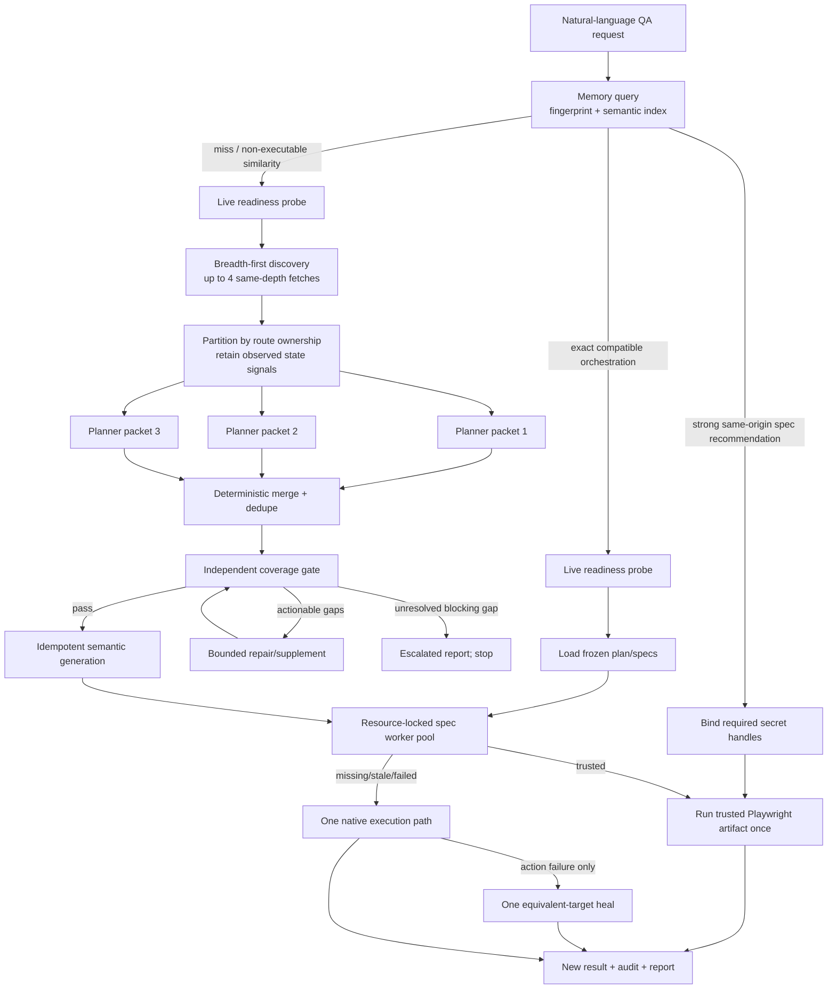

# Optimized agent orchestration

## Outcome

This change turns the autonomous-QA bundle from a mostly serial pipeline with
role-shaped callbacks into a bounded, evidence-partitioned workflow with an
executable history fast path.

The optimized runtime now:

- searches compatible project history before discovery or authoring;
- directly runs a same-origin, source-matched trusted replay when a prior spec
  is a strong semantic match, while always producing a new live verdict;
- reuses exact plan/spec artifacts only when the complete request fingerprint
  is compatible;
- crawls independent same-depth routes concurrently while preserving
  deterministic breadth-first evidence order;
- invokes up to three route-owned planner workers concurrently, merges and
  deduplicates deterministically, and sends the merged result through a
  provenance-blind deterministic coverage gate;
- executes independent specs in isolated browser contexts, with a shared lock
  for fixtures and mutable/destructive flows;
- sends each capability the smallest role-specific context packet instead of
  the conversation, skill text, raw trace, and duplicate crawl objects; and
- records the memory decision, worker fan-out, replay decision, stage timings,
  execution mode, and artifact references in the trace/report.

The companion [Current orchestration structure](current-orchestration-structure.md)
is the exact implementation reference: source topology, dispatch pseudocode,
scheduler semantics, worker envelope, invalidation keys, `.qa/` layout, and
operator controls. This document focuses on the audit and measured change.

The measured result is a **71.34% median repeat-time reduction** at the runtime
boundary over 30 controlled pairs and an **87.55% wall-time reduction** in the
observed terminal-agent repeat. The optimized cold median was 3.70% faster in
the final controlled sample; the material gain still comes from repeat work.

## Change isolation and audit method

The work is isolated on branch `codex/agent-orchestration-optimization` in a
clean worktree based on fetched `origin/main` commit
`59620aa9e3dd70475bd324a769f6676780da480c`.
The requested `git pull --ff-only origin main` fetched that revision but could
not update the original checkout because it contained overlapping user edits;
those files were left untouched, and the new worktree was created directly at
the fetched `origin/main`, giving the requested clean base without overwriting
local work.

Three audits ran in parallel before implementation:

1. orchestration and concurrency;
2. prompts and context engineering; and
3. benchmark validity, traces, cacheability, and artifact reuse.

The findings below are based on source inspection, saved traces, controlled
benchmarks, and two real Codex terminal-agent executions. Raw aggregate data is
in [`orchestration-history-2026-09-05.json`](benchmarks/orchestration-history-2026-09-05.json),
the complete per-invocation outputs are
[`orchestration-history-baseline-30.raw.json`](benchmarks/orchestration-history-baseline-30.raw.json)
and
[`orchestration-history-optimized-30.raw.json`](benchmarks/orchestration-history-optimized-30.raw.json),
and the reproducible harness is
[`benchmark-orchestration-history.mjs`](../scripts/benchmark-orchestration-history.mjs).

## Baseline critique and disposition

| Baseline issue | Why it was harmful or unnecessary | Disposition |
|---|---|---|
| “Planner”, “executor”, “healer”, and “design” were described as sub-agents, but only the planner had a proposal callback and orchestration was serial. | The documentation implied scheduling and isolation the code did not provide. | Planner work now has immutable task envelopes and actual concurrent callback fan-out. Executor work has a bounded pool. The document explicitly distinguishes host capabilities from runtime processes. |
| `planStages()` modeled a state machine but was never called. | It was decorative architecture and could drift from executed control flow. | Removed from code, tests, exports, and architecture labels. Trace events are the authoritative executed state. |
| Crawl, planner, generation, specs, expectations, and three replay validations all ran serially. | Independent latency accumulated unnecessarily. | Same-depth crawl and route-owned planning now fan out. Independent specs overlap. Ordered steps and trust validations remain serial because their state is dependent. |
| Readiness and crawl fetched the initial page twice; authenticated crawl could fetch it a third time. | It added latency and could observe inconsistent first-page states. | A successful cold-path readiness snapshot is consumed by crawl and authentication, then protected siblings use the established session. |
| Repeated prompts always crawled, planned, generated, and executed again. | Existing plans, semantic specs, and trusted Playwright artifacts provided no latency benefit. | Memory is the first runtime stage. Exact history skips crawl/plan/generation; a strong semantic recommendation runs the existing replay directly. |
| `generate()` overwrote a matching trusted replay as a candidate. | A repeated workflow destroyed the very optimization it should have reused. | Source-matched trusted replay state is preserved; generation is idempotent. |
| Similar history was effectively just a global “last test” pointer. | It was unrelated to the current objective and unsafe across specs/environments. | Search is per spec, environment, target origin, source hash, replay state, semantic overlap, and latest result. |
| Similarity divided by the smaller term set. | A one-word partial match could score `1.0` and become executable. | Sørensen–Dice overlap penalizes both missing query terms and overly broad candidates; recommendations require score `>= 0.35`. |
| Similar candidates were not filtered by application origin. | A trusted checkout replay from another local server could be recommended. | Same-origin filtering is mandatory and regression-tested. |
| Git invalidation omitted staged content and all untracked content. | An exact hit could reuse an obsolete plan after real application changes. | The revision hashes `HEAD`, binary staged/unstaged diffs, status, and content hashes of non-ignored untracked files outside `.qa/`. An unresolved revision gets a unique nonce and cannot exact-hit. |
| Planner context duplicated the raw sitemap, prompt, and PRD beside a rendered brief. | The callback paid for the same facts twice and exposed bypass paths around truncation. | One compact JSON evidence packet plus a compact wire schema is sent. Raw duplicates are absent. |
| Planner instructions imposed happy/error/edge quotas and checkout/form examples. | Those anchors biased exploration and encouraged unsupported scenarios. | One neutral evidence-grounded contract is used for every partition. Categories remain output metadata, not quotas. |
| Crawl and requirement strings were interpolated as trusted prompt prose. | Page content could act as instructions to the planner. | The packet declares an untrusted-data boundary; the planner returns schema-only JSON. |
| Planner instructions mentioned supplied secret references, but no reference list was supplied and raw card/password values were schema-valid. | A worker could invent or persist a resolved secret. | Packets now carry names-only `${QA_*}` handles. Sensitive-name or `sensitive: true` inputs must use a supplied reference; raw values are rejected. |
| Every planner worker received every PRD clause. | It multiplied tokens and encouraged duplicate cross-shard plans. | Each evidence-supported clause is assigned to one best route owner. Unsupported clauses stay with the independent gate as explicit gaps. |
| Predicate schemas allowed structurally incomplete assertions. | An assertion could count toward coverage despite lacking its executable value/selector/count. | The schema now uses kind-specific required fields. Invalid drafts are rejected before normalization. |
| Plan details such as page, action, inputs, and preconditions were discarded before semantic execution. | Executors lost the context needed to reproduce the planned journey. | Generation retains these fields in sidecars and locator/action bindings while keeping public semantic YAML selector-free. |
| Selector preflight could call `observe` before the executor was connected and interpret non-throwing behavior as proof. | Validation could be a false positive. | Preflight uses an explicit `probeLocator` capability or conservative fetch evidence; undecidable checks stay unverified. |
| Previous successful targets were supplied during normal execution and came from global recent state. | This biased action selection and could leak targets across specs. | A previous target is consulted only after a failure, keyed by spec, environment, and exact step, from a recent clean run. |
| One shared environment ID, spec namespace, and page/executor made parallel targets unsafe. | Concurrent runs could overwrite files and race browser state. | Target-derived environment/spec prefixes, fresh executor factories, and application-state resource locks isolate work. |
| CLI credentials did not populate the replay variable names used by generated specs. | Trusted checkout replay failed with missing `QA_USERNAME`/`QA_PASSWORD`. | CLI values are propagated to the supported generic and customer variable names without writing resolved values to artifacts. |
| Successful pre-authentication was reset to `false` after crawl. | Auth provenance was wrong even when the session cookie was valid. | Pre-auth state is retained and post-crawl authentication runs only if still anonymous. |
| Replay coverage checked only the number of checkpoints. | Duplicate checkpoint identities could conceal an omitted expectation. | Replay verifies the exact expected `(step, expectation)` identity set and rejects duplicates, missing, or unexpected checks. |
| A custom event callback bypassed the persisted tracer; the tracer was not always closed; IDs used millisecond time alone. | Runs could have incomplete traces or collide. | Events always go to the tracer and optional callback, close runs in `finally`, and IDs include a random suffix. |
| Coverage escalation could still continue into execution. | The report/exit code could contradict the gate. | Escalation writes a report and stops before generation/execution. |
| The old replay benchmark compared unlike timing boundaries. | Its apparent speedup was not attributable to replay reuse. | It is excluded. The new paired harness uses the same orchestration-to-persisted-report boundary for both sides. |

## Executed flow



There are two deliberate fast paths:

- `history query` is the skill-level route. A returned `recommendedSpecId` is
  run directly and audited, avoiding orchestration entirely.
- `orchestrate` performs its own exact lookup. It still probes the live target,
  then skips crawl, planner, gate reconstruction, and generation, and executes
  the existing specs. A merely similar result does not bypass those stages.

Neither path reuses an old verdict. The live application is executed every
time. The artifact reused is the trusted Playwright program and, for an exact
hit, its compatible plan/spec inputs—not old screenshots or pass/fail output.

## Context contracts

Every worker receives one immutable envelope with `contractVersion`, `taskId`,
`parentId`, deadline, input hash, evidence references, and a compact role
payload. No worker receives the full chat or parent-agent history.

| Role | Receives | Deliberately excluded | Output/validation |
|---|---|---|---|
| Memory | origin, normalized objective terms, PRD hash, auth scope, app revision, contract versions, spec/replay/result metadata | chat, resolved secrets, screenshots, raw trace bodies | exact/similar/miss plus artifact references |
| Discovery shard | target/session, same-depth route batch, page/depth limits | expected defects, plan, prior verdict, other depths | normalized page facts; response order restored deterministically |
| Planner worker | normalized objective, one route-owned evidence packet, opaque evidence hashes, cross-partition link edges, relevant PRD clauses, auth provenance, names-only value references, compact wire schema | full sitemap, full skill, raw HTML, resolved secrets, prior plan/score, unrelated PRD clauses | strict bounded `plan-draft.schema.json` JSON; one size-bounded schema-repair attempt |
| Merge/gate | merged plan, full objective/PRD, compact evidence index, coverage invariants | worker identity, desired outcome, previous gate score | deduplicated plan and deterministic gaps/verdict |
| Executor worker | one frozen spec, current environment, referenced fixtures, secret handles, fresh browser context | whole suite, full chat/history, resolved secret values | schema-valid result, replay receipt, evidence refs |
| Healer | failed action, unchanged expectations, current accessible state, failure evidence, same-spec/environment/step prior target | editable expectations, desired classification, unrelated runs | at most one equivalent target plus before/after evidence |
| Design comparator | explicit reference, actual checkpoint capture, viewport, fixed rubric | functional verdict, planner rationale, credentials | structured concrete findings only |
| Reporter | validated outputs, timings, cache/replay decisions, artifact paths | secrets, screenshots as inline prompt content, chat | schema-valid JSON/Markdown report |

The memory dependency boundaries are intentionally different:

```text
exact orchestration = target + objective terms + PRD + planner mode
                    + crawl limits + auth scope + app revision
                    + prompt/crawler/generator/schema contract versions

trusted replay      = semantic spec + selected environment + fixtures
                    + replay generator version + replay script hash

semantic recommendation = same origin + two-sided lexical overlap
                        + source-matched trusted replay
                        + latest result is passed/healed
```

Changing a dependency invalidates only the reusable layer above it. A changed
application revision invalidates exact planning reuse, but a trusted semantic
candidate may still be run as a live probe: failure rejects the replay and
falls through once; no historical pass is copied forward.

## Parallelization and locking policy

| Work | Parallel rule | Default bound | Reason |
|---|---|---:|---|
| Same-depth crawl routes | Concurrent with one established cookie snapshot; process responses in queue order | 4 default, 8 max | Independent network latency overlaps without changing evidence order. |
| Planner partitions | Concurrent route owners retaining observed state signals; compact cross-route edges included | 3 max | Each worker owns a disjoint surface; deterministic merge removes duplicates. |
| Independent specs | Concurrent only with executor factories/fresh contexts, or trusted replays with no shared native fallback | 3 default, 8 max | Browser/page state is isolated; a supplied shared fallback forces serial execution, and lock waiters do not consume execution slots. |
| Fixtures or mutable/destructive specs | Shared application lock | 1 per shared resource | Prevents order, account, cart, and cleanup races. |
| Ordered steps and expectations | Serial within a spec | 1 | Later state depends on earlier actions. |
| Healing | Failure-only and serial in the failed spec | 1 retry | Parallel alternatives would race state and hide uncertainty. |
| Replay trust validation | Three fresh, serial, zero-retry passes | 3 sequential passes | Independence across runs is evidence; parallel runs could share mutable backend state. |
| Reporting/storage commit | Deterministic ordered aggregation | 1 | Stable output and atomic last-test state. |

The runtime does not itself create operating-system agent processes or call an
LLM. `planWithParallelAgents()` concurrently invokes the planner capability
provided by the host. In Codex, that capability may be backed by actual
sub-agents; without it, the runtime records a deterministic fallback. This is
an explicit boundary, not hidden “agent” theater.

## Bias and prompt compression

The optimization does not claim that model exploration can be mathematically
unbiased. It removes avoidable structural anchors and makes remaining choices
auditable:

- partitioning is based on observed route ownership, not preassigned
  happy/error/security personas;
- every partition uses the same neutral planner instructions;
- happy/error/edge labels are accepted metadata, not quotas;
- literal assertions must come from evidence, sensitive inputs must use
  supplied names-only references, and unsupported claims become
  `openQuestions` or gate gaps;
- worker provenance and prior scores are stripped before the gate;
- PRD clauses go only to a best matching evidence owner; unmatched clauses are
  visible as uncovered rather than assigned arbitrarily; and
- merge order, deduplication signatures, and fallback reasons are deterministic.

Measured with `tiktoken 0.11.0` and `o200k_base`:

| Prompt surface | Baseline | Optimized | Reduction |
|---|---:|---:|---:|
| `SKILL.md` | 3,427 tokens | 1,892 tokens | 44.79% |
| Planner instructions | 655 tokens | 181 tokens | 72.37% |
| Fixed unpartitioned planner callback | 1,986 tokens | 1,351 tokens | 31.97% |
| Fixed partitioned worker packet (median) | 1,986 tokens | 793 tokens | 60.07% |

The skill text also fell from 2,479 to 1,290 whitespace-delimited words and
from 17,211 to 9,594 UTF-8 bytes. Token counts are measurements of the checked
files, not estimates.

The three actual partition packets for that fixture were 1,046, 793, and 772
tokens. Their combined 2,611 tokens are 31.47% above the old single callback;
the optimization reduces per-worker context and overlaps latency while buying
broader independent exploration. It does **not** claim lower aggregate tokens
for a cold three-worker plan. History hits avoid all planner packets, which is
where the end-to-end token reduction comes from.

## Benchmark results

### Controlled runtime benchmark

Protocol:

- baseline runtime: exact `origin/main` revision `59620aa9e3dd70475bd324a769f6676780da480c`;
- application: immutable two-route loopback server owned by the harness;
- objective: `verify that opening the status panel shows the ready page`;
- boundary: `orchestrate()` entry through persisted report;
- 3 discarded warmups followed by 30 paired cold/repeat workspaces;
- fresh Playwright browser for each replay and lazy native context creation;
- correctness required exit `0`, verdict `clean`, and identical semantic source
  and replay script hashes between cold and repeat; and
- environment: macOS 15.5, Apple M4, Node 25.8.1, Chrome 152.0.7977.76.

| Runtime | Path | Median | p95 | MAD | Min–max |
|---|---|---:|---:|---:|---:|
| Baseline | cold | 678.42 ms | 683.97 ms | 3.94 ms | 641.79–685.31 ms |
| Baseline | repeat | 680.56 ms | 685.52 ms | 2.77 ms | 646.41–696.33 ms |
| Optimized | cold | 654.22 ms | 685.91 ms | 14.43 ms | 635.27–687.44 ms |
| Optimized | repeat | 195.08 ms | 198.03 ms | 0.88 ms | 192.83–204.84 ms |

Observed comparisons:

- baseline repeat was **0.32% slower** than baseline cold and had `0/30`
  history hits and `0/30` direct replay hits;
- optimized repeat was **70.18% faster** than optimized cold;
- optimized repeat was **71.34% faster** than baseline repeat;
- optimized cold was **3.57% faster** than baseline cold;
- all `120/120` measured invocations met the correctness condition; and
- optimized repeats hit exact history `30/30` and trusted replay `30/30`.

The exact-history search stage measured **1 ms median and 2 ms p95** across
all 30 optimized repeats (1–2 ms). The remaining repeat time is the new live
readiness check, trusted Playwright execution, persistence, audit, and report;
the prior verdict itself is never reused.

Repeat-path work totals show what disappeared:

| Runtime (30 repeats) | Planner calls | Native executor creations | Agent calls | Replay browser launches | Screenshots |
|---|---:|---:|---:|---:|---:|
| Baseline | 30 | 30 | 30 | 90 | 30 |
| Optimized | 0 | 0 | 0 | 30 | 0 |

The optimized path still launches a browser and asserts the live page. Zero
screenshots here means it did not regenerate redundant passing screenshots; it
does not mean old screenshot evidence was treated as a current result.

### Terminal-agent execution

A real Codex terminal agent was run against the demo checkout/authentication
journey. The baseline agent had to diagnose a browser capability failure,
construct a semantic spec/replay, perform three trust validations, and run the
canonical replay. The optimized repeat queried history, selected
`checkout-authentication-card`, bound only its three required variables, ran
one trusted Playwright replay, and audited the new result.

| Metric | Baseline cold agent | Optimized repeat agent | Reduction |
|---|---:|---:|---:|
| Wall time | 499.61 s | 62.19 s | 87.55% |
| Input tokens | 3,238,496 | 190,698 | 94.11% |
| Cached input tokens | 3,111,936 | 158,336 | 94.91% |
| Output tokens | 28,598 | 3,498 | 87.77% |
| Reasoning tokens | 18,477 | 1,913 | 89.65% |

The optimized run saved `run_20260905_082536_858e27`; its replay phase took
1,325 ms, execution mode was `playwright`, model/native agent calls were `0`,
and the governance audit passed. This is one end-to-end observation, not a
statistical latency distribution; the controlled 30-pair result is the primary
performance claim.

Excluded measurements are recorded in the raw JSON: the asymmetric legacy
benchmark, a censored browser-plugin run that produced no result, and an
intermediate optimized run made before recommendation wording was corrected.

## Implementation map

- [`history.js`](../src/history.js): canonical request fingerprints, exact
  manifests, same-origin semantic search, required-variable extraction.
- [`orchestrator.js`](../src/orchestrator.js): memory-first control flow,
  revision hashing, unique IDs, bounded worker pool/resource locks, stage
  timing, correct escalation, always-on tracing.
- [`planner.js`](../src/planner.js): deterministic concurrent breadth-first
  crawl and retained authentication provenance.
- [`planner-agent.js`](../src/planner-agent.js): compact neutral contract,
  immutable task envelopes, route partitions, PRD ownership, concurrent fan-out,
  deterministic merge/dedupe.
- [`generator.js`](../src/generator.js): target-specific IDs/environments,
  preserved plan details, conservative preflight, idempotent trusted replay.
- [`replay.js`](../src/replay.js): lazy native executor creation and exact
  checkpoint-identity coverage.
- [`execution.js`](../src/execution.js): failure-only, per-spec/environment/step
  target history.
- [`storage.js`](../src/storage.js): non-selecting concurrent result writes and
  one deterministic atomic last-result selection after worker join.
- [`cli.js`](../src/cli.js): `history query`, concurrency controls, app revision,
  secret-variable propagation.
- [`plan-draft.schema.json`](../schemas/plan-draft.schema.json): kind-specific
  predicate requirements.
- [`SKILL.md`](../.agents/skills/autonomous-qa/SKILL.md): compressed,
  memory-first workflow and role context contracts.
- [`history.test.js`](../test/history.test.js),
  [`planner-agent.test.js`](../test/planner-agent.test.js), and
  [`planner-crawl.test.js`](../test/planner-crawl.test.js): cache safety,
  fan-out, context ownership, locks, and deterministic concurrency coverage.

## Verification status

`npm test` passes **259/259** tests on the optimized branch. The packaged skill
is rebuilt before the test run, so these checks exercise the generated bundle
as well as source modules.

The repository's stricter coverage command executes all tests successfully but
does not meet its configured aggregate thresholds on the current Node 25.8.1
runtime:

| Revision | Tests passed | Lines | Branches | Functions | Required |
|---|---:|---:|---:|---:|---:|
| Exact untouched baseline | 207 | 96.93% | 83.33% | 95.23% | 100% / 95% / 98% |
| Optimized branch | 259 | 97.46% | 83.36% | 93.15% | 100% / 95% / 98% |

This gate was already red on the exact baseline. The optimized suite raises
line and branch coverage by 0.53 and 0.03 points; function coverage is 2.08
points lower. It is therefore both pre-existing debt and an
unresolved verification gap for this change—not a green check. The new history,
fan-out, origin isolation, revision hashing, resource locking, CLI controls,
and crawl concurrency paths have direct behavioral tests despite the
repository-wide aggregate failure.

## Remaining constraints

These are intentionally not hidden by the optimization:

1. Host capabilities are required for model-based planning/native judgement.
   The runtime can fan out calls but cannot create provider agents itself.
2. The “critic” is currently the deterministic coverage gate, not a second
   model. This keeps it independent and repeatable but limits semantic critique.
3. Similarity is conservative lexical overlap, not an embedding index. A safe
   false miss costs time; a recommendation still has to pass the live replay.
4. Non-git or revision-resolution failures disable exact reuse unless the
   caller supplies `--app-revision`; they do not silently share `unknown`.
5. Fetch discovery can mark client-rendered SPAs as degraded; browser-native
   discovery remains a host capability rather than a parallel crawler.
6. Resource classification uses fixtures plus intent terms. Unknown backend
   side effects should be declared through fixtures or forced to concurrency 1.
7. Fixture postconditions are executed by the trusted replay contract but are
   not yet represented as independent `(fixture, expectation)` checkpoints.
8. Passing replay runs intentionally do not create new screenshots. A failure
   falls back to the evidence-producing native path; an old screenshot is never
   presented as current evidence.
9. Three replay trust validations remain serial by design. Parallel validation
   against mutable data would weaken, not strengthen, the trust signal.
10. The resource scheduler coordinates workers inside one orchestration.
    Concurrent orchestration processes still need an external project-level
    lock if they target the same mutable account or backend.

## Reproduce

From the optimized worktree:

```bash
npm run build:skill
npm test
npm run test:coverage
npm run benchmark:orchestration -- --samples 30 --warmups 3 --output /tmp/optimized-history.json
```

To compare the exact baseline, prepare a detached worktree at the recorded
revision, install its locked dependencies, and point the same harness at it:

```bash
git worktree add --detach /tmp/auto-qa-baseline 59620aa9e3dd70475bd324a769f6676780da480c
npm --prefix /tmp/auto-qa-baseline ci
node scripts/benchmark-orchestration-history.mjs --samples 30 --warmups 3 --module-root /tmp/auto-qa-baseline --output /tmp/baseline-history.json
```

The benchmark owns and closes its loopback server and browsers. The two
committed raw JSON outputs keep every invocation, trace summary, cache outcome,
replay launch count, source hash, script hash, execution mode, and agent-call
count so aggregate claims can be recomputed rather than trusted from prose.
