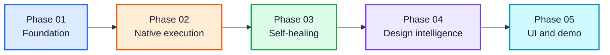

# Implementation Phases

This roadmap turns the hackathon MVP in [README.md](README.md) into five implementation phases. Each phase ends with a demonstrable product increment and has explicit exit criteria.

The phases intentionally exclude production-scale infrastructure such as Stagehand, hosted CI/CD orchestration, scheduling, SQLite, multi-user authentication, and enterprise audit systems. A constrained Playwright replay is included because the challenge requires generated executable tests; it remains derived from semantic source and is never hand-authored by the developer.

## Phase overview

| Phase | Summary | Demonstrable outcome |
| --- | --- | --- |
| [Phase 01 — Foundation](phases/phase_01_foundation.md) | Define the semantic spec, fixture, environment, result, and last-test contracts; implement the file-backed `.qa/` workspace. | A natural-language scenario can be saved as validated, editable YAML and selected as the most recent test. |
| [Phase 02 — Native execution and fixtures](phases/phase_02_native_execution.md) | Implement the skill workflow, environment resolution, reusable fixtures, and native Browser/Chrome or computer-use execution. | A real local or staging journey runs with reusable login and cleanup workflows. |
| [Phase 03 — Self-healing and classification](phases/phase_03_self_healing.md) | Add semantic target rediscovery, unchanged-expectation verification, and the small result taxonomy. | Harmless UI drift heals while a real functional failure remains a failure. |
| [Phase 04 — Design intelligence and evidence](phases/phase_04_design_intelligence_and_evidence.md) | Compare the rendered app with an explicit reference and persist concise evidence-backed results. | An obvious design deviation produces a supported `design_regression` with screenshots. |
| [Phase 05 — UI and demo integration](phases/phase_05_ui_and_demo.md) | Build the minimal localhost UI, wire recent runs and editing, and harden the four hackathon demos. | Judges can understand, run, inspect, edit, and rerun the complete product story. |

## Dependency order

## Cross-phase rules

- Preserve semantic intent and expected outcomes; do not make selectors the source of truth.
- Use native Browser/Chrome or computer use for tests and fixtures.
- Never rewrite an expectation to make a failing test pass.
- Keep storage file-backed and inspectable throughout the hackathon.
- Every phase must improve one of the four final demo scenarios.
- Defer anything listed under “Explicitly out of scope” in the README.

## MVP completion gate

The implementation is complete only when every phase exit criterion passes and the acceptance checklist in the README is satisfied end to end.
